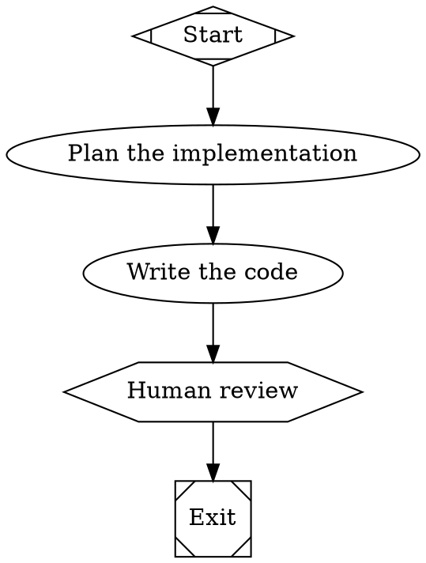

# Attractor

Attractor executes software pipelines defined as DOT digraphs. Each node represents a stage — an LLM call, a human review, a shell command, or a parallel fan-out — and edges define the flow between them.

## Quick Start

Requires Python 3.12+ and [uv](https://docs.astral.sh/uv/).

```bash
git clone https://github.com/gutelius/attractor.git
cd attractor
uv sync --all-packages --all-extras
```

Write a pipeline (`my-pipeline.dot`):



Validate and run:

```bash
uv run attractor validate my-pipeline.dot
uv run attractor run my-pipeline.dot --dry-run
```

See the [Tutorial](./docs/tutorial.md) for the full walkthrough.

## Packages

| Package | Purpose |
|---------|---------|
| **attractor** | DOT parser, graph engine, CLI, HTTP server |
| **attractor-llm** | Unified LLM client (OpenAI, Anthropic, Gemini) |
| **attractor-agent** | Coding agent loop with tool execution |

## Documentation

- **[Tutorial](./docs/tutorial.md)** — learn by building a complete product from idea to shipped code
- **[Cookbook](./docs/cookbook.md)** — copy-paste pipeline patterns for common scenarios
- **[Concepts](./docs/concepts.md)** — understand how Attractor thinks
- **[Reference](./docs/reference.md)** — look up every attribute, operator, and event

## Specifications

NLSpecs for implementors building their own Attractor:

- **[Attractor Spec](./attractor-spec.md)** — pipeline engine NLSpec
- **[Coding Agent Loop Spec](./coding-agent-loop-spec.md)** — agent loop NLSpec
- **[Unified LLM Client Spec](./unified-llm-spec.md)** — LLM client NLSpec

## Building Your Own Attractor

This repository contains [NLSpecs](#terminology) for building your own version of Attractor. Supply the following prompt to a modern coding agent (Claude Code, Codex, OpenCode, Amp, Cursor, etc):

```
codeagent> Implement Attractor as described by https://github.com/strongdm/attractor
```

## Terminology

- **NLSpec** (Natural Language Spec): a human-readable spec intended to be directly usable by coding agents to implement and validate behavior.
