# Attractor Cookbook

Each recipe is self-contained: a problem, a complete .dot file, an explanation, and a command to try it.

---

## Basic Patterns

### Recipe 1: Linear Pipeline

**Problem:** I want the simplest possible pipeline.

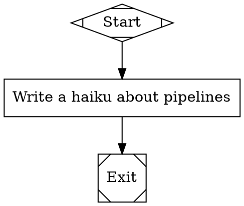

**How it works:** Three nodes connected in a straight line. `Start` (shape `Mdiamond`) marks the entry point. `Task` (shape `box`) sends its label to the LLM as a prompt. `Exit` (shape `Msquare`) marks the end.

The engine begins at `Start`, follows the single outgoing edge to `Task`, calls the LLM with the label text, then follows the edge to `Exit` and stops. No branching, no conditions, no loops.

This is the foundation for every Attractor pipeline. Add complexity only when you need it.

**Try it:**
```bash
uv run attractor validate linear.dot
uv run attractor run linear.dot --dry-run
```

---

### Recipe 2: Pipeline with Goal and Prompt Templates

**Problem:** I want to control what the LLM does at each step.

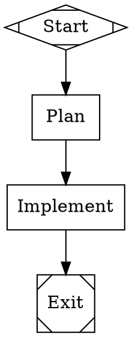

**How it works:** The `goal` attribute on the graph sets a project-wide objective. Each node uses a `prompt` attribute instead of relying on the label for the LLM instruction. Inside the prompt, `$goal` expands to the graph's goal string at load time.

This separation keeps labels short for display while giving the LLM detailed instructions. The `Plan` node receives "Create a detailed plan to Build a REST API for managing bookmarks..." as its full prompt. The `Implement` node gets its own tailored prompt with the same goal substituted in.

Use `prompt` whenever the label alone is not enough to direct the LLM. Use `$goal` to avoid repeating your project description in every node.

**Try it:**
```bash
uv run attractor validate goal-pipeline.dot
uv run attractor run goal-pipeline.dot --dry-run
```

---

### Recipe 3: Dry-Run for Testing Structure

**Problem:** I want to test my pipeline logic without incurring LLM costs.

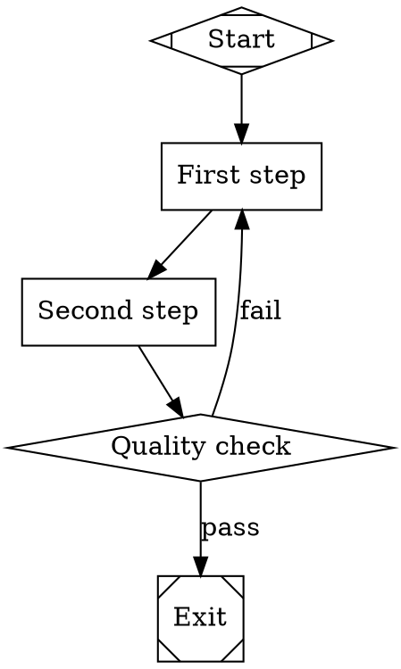

**How it works:** The `--dry-run` flag tells Attractor to walk the graph without calling any LLM. It validates structure (every node reachable, start and exit present, no orphan edges) and traces the execution path, reporting which nodes would run and in what order.

Dry-run catches structural errors early: missing start or exit nodes, unreachable nodes, malformed conditions, and invalid shapes. It costs nothing and runs in milliseconds.

Run `validate` first to check syntax, then `--dry-run` to trace execution. Make this part of your development loop: edit the .dot file, validate, dry-run, then run for real only when the structure is correct.

**Try it:**
```bash
uv run attractor validate dryrun.dot
uv run attractor run dryrun.dot --dry-run
```

---

## Branching & Routing

### Recipe 4: Binary Decision

**Problem:** I need different paths for success and failure.

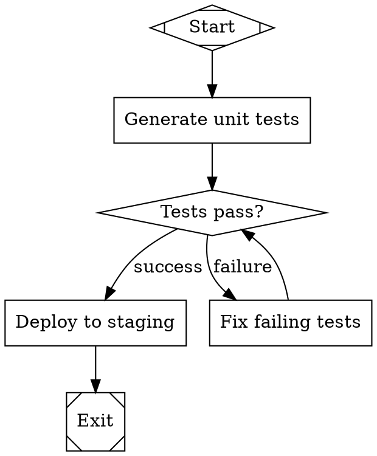

**How it works:** The `Check` node uses shape `diamond`, which makes it a conditional node. After the LLM evaluates the node, the engine inspects the outcome and evaluates each outgoing edge's `condition` attribute.

The condition `outcome=success` matches when the LLM reports success. The condition `outcome=fail` matches when it reports failure. Only one edge fires. If the tests fail, the pipeline routes to `Fix` and loops back to `Check` for another attempt.

Conditional nodes are the primary branching mechanism in Attractor. The `diamond` shape signals that this node exists to make a routing decision, not to produce output.

**Try it:**
```bash
uv run attractor validate binary-decision.dot
uv run attractor run binary-decision.dot --dry-run
```

---

### Recipe 5: Multi-Way Branch

**Problem:** I need more than two outcomes from a decision.

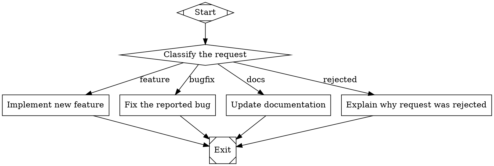

**How it works:** A diamond node can have any number of outgoing edges. Each edge has a distinct `condition` that checks a context value. The `Classify` node's LLM handler sets `context.request_type` in its outcome's `context_updates`, and the engine evaluates every outgoing edge's condition against the current context.

The engine evaluates conditions in order. When multiple conditions match, it picks the edge with the highest `weight` (defaulting to 0), then breaks ties lexically by target node ID. In practice, design your conditions to be mutually exclusive so exactly one fires.

You can extend this pattern to any number of branches. Add more edges with more conditions. There is no hard limit on outgoing edges from a conditional node.

**Try it:**
```bash
uv run attractor validate multi-branch.dot
uv run attractor run multi-branch.dot --dry-run
```

---

### Recipe 6: Weighted Edges

**Problem:** When multiple edges match, I want to control which one wins.

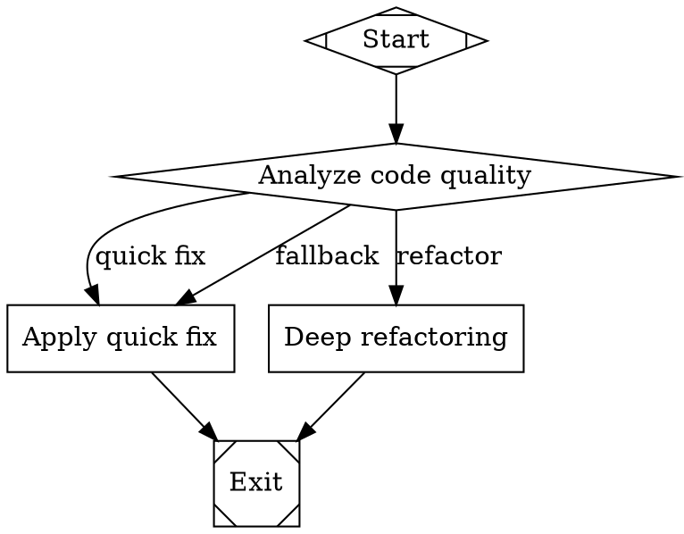

**How it works:** When the engine evaluates outgoing edges from a node, it first collects all edges whose conditions match. If more than one matches, it picks the edge with the highest `weight`. The default weight is 0.

In this example, when `Analyze` returns success, both the "quick fix" (weight 1) and "refactor" (weight 10) edges match. The engine picks "refactor" because weight 10 beats weight 1. If `Analyze` fails, only the "fallback" edge matches, so no weight comparison is needed.

Use weights to express preference among overlapping conditions. The pattern is particularly useful when you want a default path (low weight) and a preferred path (high weight) that share the same condition.

**Try it:**
```bash
uv run attractor validate weighted.dot
uv run attractor run weighted.dot --dry-run
```

---

### Recipe 7: Preferred Label Matching

**Problem:** I want the LLM to choose which path to follow.

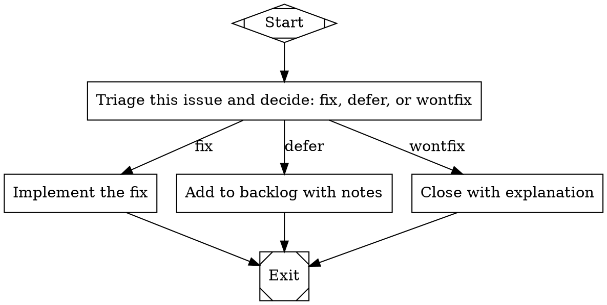

**How it works:** When a node's LLM handler returns an `Outcome` with a `preferred_label` field, the engine matches that value against the labels on outgoing edges. If the LLM sets `preferred_label = "defer"`, the engine follows the edge labeled "defer".

Label matching is case-insensitive and ignores accelerator key prefixes (like `[A]` or `K)`). The engine normalizes both the preferred label and edge labels before comparing.

This pattern differs from condition-based routing because the LLM itself decides the path. No conditions are needed on the edges -- just labels. The engine's routing priority is: (1) condition matches, (2) preferred label, (3) suggested next IDs, (4) weight and lexical tiebreak. Since these edges have no conditions, preferred label matching takes effect.

**Try it:**
```bash
uv run attractor validate preferred-label.dot
uv run attractor run preferred-label.dot --dry-run
```

---

### Recipe 8: Context-Based Conditions

**Problem:** I need routing based on data from earlier stages.

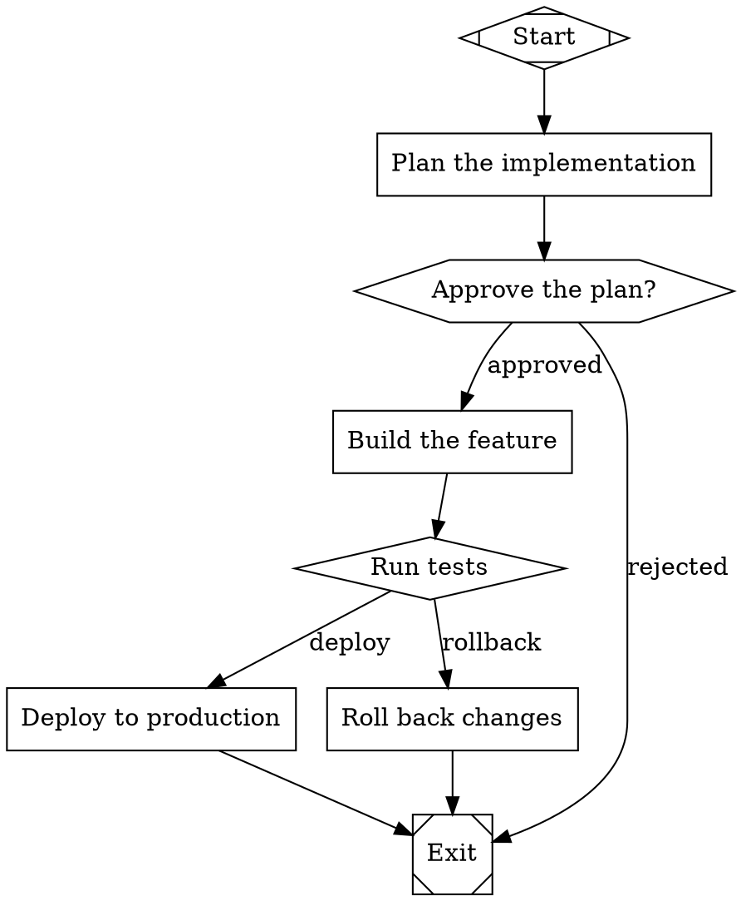

**How it works:** Conditions can reference values stored in the pipeline's shared context using the `context.` prefix. In this example, the `Test` node's "deploy" edge requires both `context.approval=granted` and `outcome=success`. The `&&` operator combines multiple clauses -- all must be true for the edge to match.

Context values are set by earlier nodes through their outcome's `context_updates` dictionary. The `Approve` node might set `context.approval = "granted"` when the human approves. Later, the `Test` node's edge checks that value to confirm approval is still on record before deploying.

The condition evaluator supports three operators: `=` (equals), `!=` (not equals), and bare key checks (truthy). Combine clauses with `&&` for AND logic. This gives you enough power to route on any combination of outcome status and accumulated context data.

**Try it:**
```bash
uv run attractor validate context-conditions.dot
uv run attractor run context-conditions.dot --dry-run
```

---

## Human-in-the-Loop

### Recipe 9: Single Approval Gate

**Problem:** I need human sign-off before proceeding.

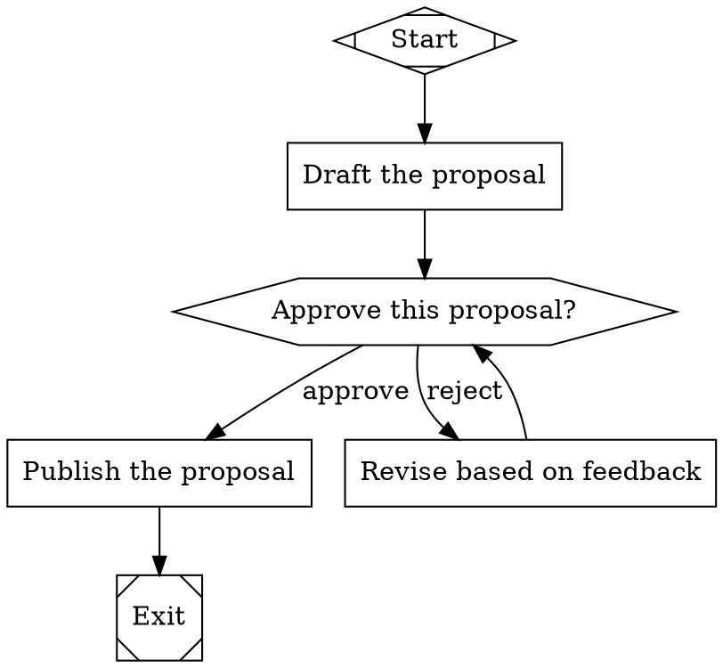

**How it works:** The `Review` node uses shape `hexagon`, which makes it a human gate. When the engine reaches this node, it pauses execution and presents the accumulated context to a human reviewer. The reviewer either approves (outcome = success) or rejects (outcome = fail).

The two outgoing edges use conditions to route based on the reviewer's decision. Approval proceeds to `Publish`. Rejection routes to `Revise`, which loops back to `Review` for another round.

Human gates are blocking: the pipeline waits indefinitely until the reviewer responds. In production, configure a `timeout` attribute on the node to set a maximum wait time.

**Try it:**
```bash
uv run attractor validate approval-gate.dot
uv run attractor run approval-gate.dot --dry-run
```

---

### Recipe 10: Multi-Option Review

**Problem:** I need the reviewer to choose from several actions.

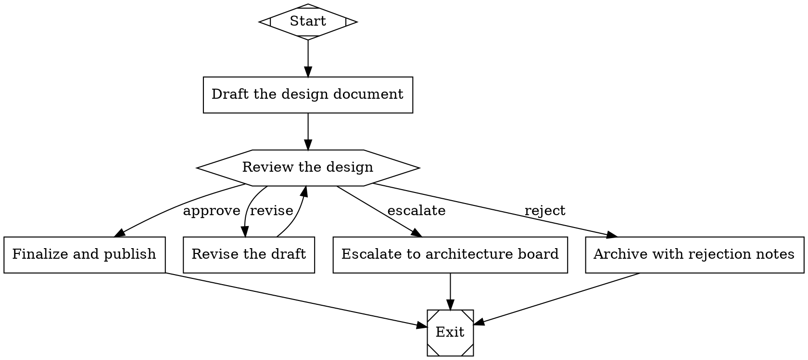

**How it works:** A hexagon node can have any number of outgoing edges, each representing a distinct reviewer action. The engine presents these as options to the human. The reviewer's selection sets `preferred_label` on the outcome, and the engine matches it against the edge labels.

No `condition` attributes are needed here. The edges use only labels, and the engine's preferred-label matching handles the routing. This keeps the .dot file clean when the human is making a free choice rather than the pipeline evaluating data.

The `Revise` path loops back to `Review`, letting the reviewer iterate as many times as needed. The other paths are terminal -- they proceed to `Exit` after one step.

**Try it:**
```bash
uv run attractor validate multi-option.dot
uv run attractor run multi-option.dot --dry-run
```

---

### Recipe 11: Accelerator Keys

**Problem:** I want keyboard shortcuts for faster review.

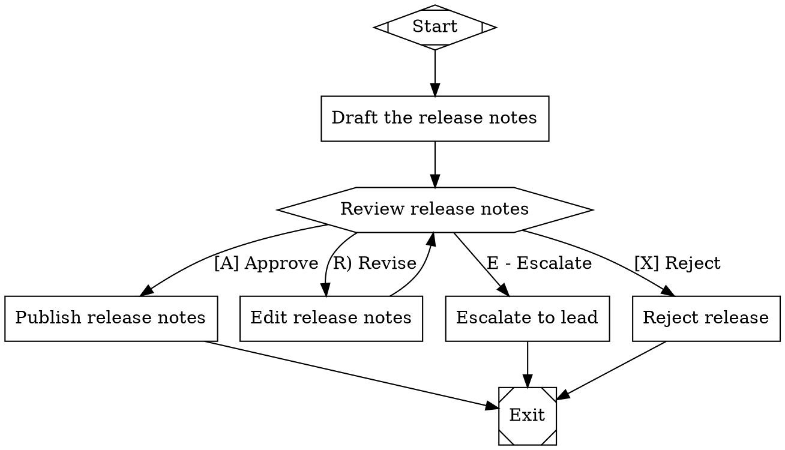

**How it works:** Edge labels can embed accelerator keys using three patterns: `[K] Label`, `K) Label`, or `K - Label`. The engine's `parse_accelerator_key` function extracts the key character. At the terminal, the reviewer presses a single key instead of typing the full label.

The engine normalizes labels before matching. When the reviewer presses `A`, the engine strips the `[A]` prefix from "[A] Approve" and compares the normalized form. This means the LLM's preferred-label matching also works: a preferred label of "approve" matches "[A] Approve" after normalization.

Mix accelerator formats freely. The three formats (`[K]`, `K)`, `K -`) are equivalent -- choose whichever reads best for your use case. If no accelerator prefix is present, the engine uses the label's first character as the default key.

**Try it:**
```bash
uv run attractor validate accelerators.dot
uv run attractor run accelerators.dot --dry-run
```

---

### Recipe 12: Recording Decisions for Audit

**Problem:** I need an audit trail of all human decisions.

This recipe is programmatic. You configure the `RecordingInterviewer` in Python code rather than in the .dot file. The pipeline itself is a standard human-gate pipeline:

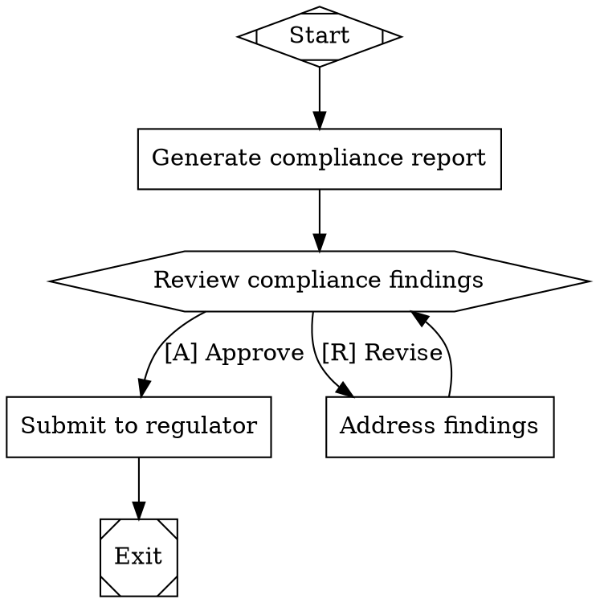

Wrap your interviewer with `RecordingInterviewer` to capture every question and answer:

```python
from attractor.interviewer import RecordingInterviewer, TerminalInterviewer

# Create the base interviewer (the one that actually talks to the human)
terminal = TerminalInterviewer()

# Wrap it with RecordingInterviewer to capture all interactions
recorder = RecordingInterviewer(inner=terminal)

# Pass the recorder to the engine configuration
# engine = Engine(config=EngineConfig(interviewer=recorder))

# After the pipeline completes, access the audit log:
for question, answer in recorder.recordings:
    print(f"Stage: {question.stage}")
    print(f"Question: {question.text}")
    print(f"Answer: {answer.value}")
    print("---")
```

**How it works:** `RecordingInterviewer` is a decorator that wraps any interviewer implementation. It delegates every `ask` and `ask_multiple` call to the inner interviewer, then stores the `(Question, Answer)` pair in its `recordings` list.

The recordings capture the full question object (including the stage name, question type, and available options) and the full answer object (including the selected option and freeform text). This gives you a complete audit trail without modifying the pipeline graph or the review workflow.

For persistent storage, iterate over `recorder.recordings` after the pipeline completes and write the entries to your audit system -- a database, a JSON file, or a compliance log. The `question.stage` field tells you which pipeline node triggered the interaction.

**Try it:**
```bash
uv run attractor validate audit-trail.dot
uv run attractor run audit-trail.dot --dry-run
```

---

## Iteration & Retry

### Recipe 13: Revise-and-Resubmit Loop

**Problem:** I want the pipeline to keep revising until the reviewer approves.

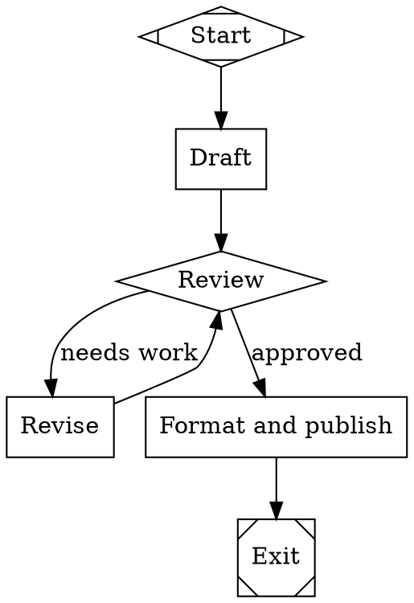

**How it works:** The `Review` node evaluates the draft and returns success or fail. On failure, the pipeline routes to `Revise`, which improves the draft using the review feedback accumulated in context. `Revise` then loops back to `Review` for another round.

This cycle repeats until `Review` returns success. Each iteration adds to the context, so the reviewer sees previous feedback and the reviser sees previous review comments. The pipeline converges toward quality naturally because each revision addresses specific criticisms.

To prevent infinite loops, set `max_retries` on the `Review` node or rely on the engine's `max_steps` limit (default 1000). In practice, most revise-and-resubmit loops converge within 3-5 iterations.

**Try it:**
```bash
uv run attractor validate revise-resubmit.dot
uv run attractor run revise-resubmit.dot --dry-run
```

---

### Recipe 14: Retry with max_retries

**Problem:** I want a node to retry automatically on failure.

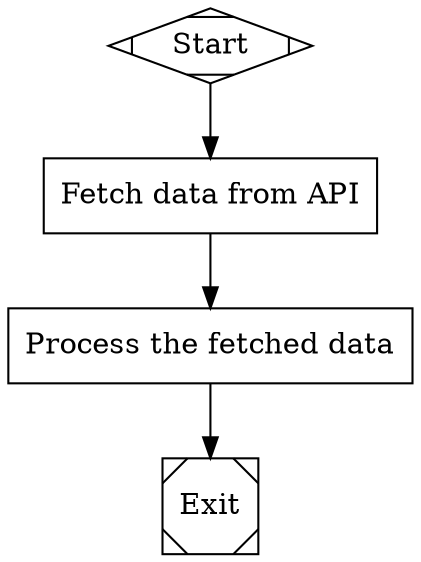

**How it works:** The `max_retries` attribute on `FetchData` tells the engine to attempt the node up to 4 times total (1 initial attempt + 3 retries). If the handler throws an exception or returns a `RETRY` status, the engine waits briefly and tries again.

When all retries are exhausted and the node still fails, the engine returns a `FAIL` outcome. The pipeline then follows the normal edge-selection logic -- if there is an outgoing edge with `condition="outcome=fail"`, it takes that path. Otherwise, the pipeline stops.

You can also set `default_max_retry` on the graph itself to apply a retry limit to every node that does not specify its own. The node-level `max_retries` always overrides the graph default.

**Try it:**
```bash
uv run attractor validate retry.dot
uv run attractor run retry.dot --dry-run
```

---

### Recipe 15: Goal Gate Enforcement

**Problem:** I need a mandatory quality check before the pipeline can complete.

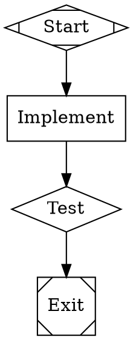

**How it works:** The `goal_gate=true` attribute on `Test` marks it as a mandatory checkpoint. When the pipeline reaches the `Exit` node, the engine checks every goal gate. If any goal gate has a non-success outcome, the engine does not exit. Instead, it looks at the gate's `retry_target` attribute and routes back to that node.

Here, if `Test` failed, the engine jumps back to `Implement` for another attempt. The pipeline keeps cycling between `Implement` and `Test` until the tests pass or the engine hits `max_steps`.

Goal gates are enforced at exit time, not at the gate node itself. This means the pipeline can pass through a goal gate node, continue downstream, and still be forced to revisit if the gate's outcome was not success. The `retry_target` can point to any node in the graph, not just the immediate predecessor.

**Try it:**
```bash
uv run attractor validate goal-gate.dot
uv run attractor run goal-gate.dot --dry-run
```

---

### Recipe 16: allow_partial

**Problem:** I'd rather have partial results than a complete failure.

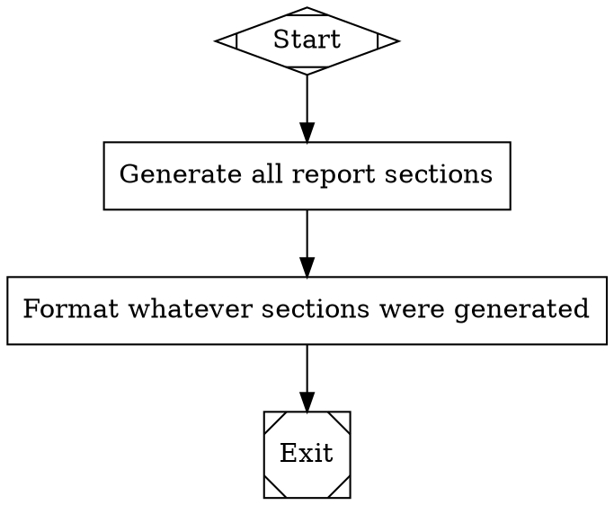

**How it works:** When `Generate` exhausts its 3 retries and the handler returns a `RETRY` status, the engine normally returns `FAIL`. With `allow_partial=true`, the engine instead returns `PARTIAL_SUCCESS`. The pipeline continues to the next node rather than stopping.

The `Format` node receives whatever partial output `Generate` produced. This is useful for long-running or unreliable operations where some output is better than none -- report generation, data collection from multiple sources, or batch processing where individual items may fail.

`allow_partial` only activates when retries are exhausted and the last status is `RETRY`. If the handler returns an explicit `FAIL` (not `RETRY`), the node fails immediately regardless of `allow_partial`. This distinction lets handlers signal "I might succeed with another try" (RETRY) versus "this is unrecoverable" (FAIL).

**Try it:**
```bash
uv run attractor validate allow-partial.dot
uv run attractor run allow-partial.dot --dry-run
```

---

### Recipe 17: loop_restart

**Problem:** I want to start the entire pipeline over from scratch on failure.

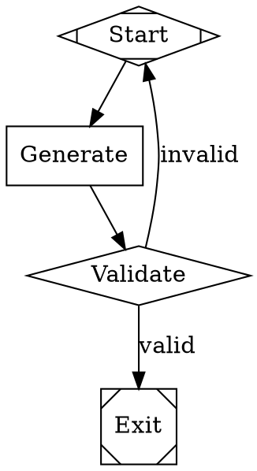

**How it works:** The edge from `Validate` back to `Start` has `loop_restart=true`. When the engine follows this edge, it clears all state: completed nodes, node outcomes, retry counts, and context. The pipeline starts fresh from the target node as if it had never run.

This differs from a normal loop. A normal back-edge preserves context, so the LLM sees its previous attempts. With `loop_restart`, the LLM has no memory of prior failures. This is useful when accumulated context is part of the problem -- for example, when a confused generation pollutes the context and makes subsequent attempts worse.

Use `loop_restart` sparingly. In most cases, preserving context across iterations helps the pipeline converge. Reserve full restarts for situations where you need a clean slate, such as when the LLM's output is fundamentally off-track and revision would be harder than starting over.

**Try it:**
```bash
uv run attractor validate loop-restart.dot
uv run attractor run loop-restart.dot --dry-run
```

---

## Evaluation & Quality

### Recipe 18: LLM-as-Judge

**Problem:** I want an LLM to evaluate another LLM's output.

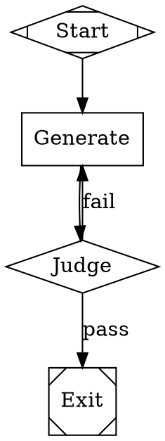

**How it works:** The `Judge` node is a separate LLM call whose only job is evaluation. It receives the full context, including `Generate`'s output, and returns a pass/fail verdict. The `diamond` shape makes it a conditional node, so the engine routes based on its outcome.

This pattern separates generation from evaluation. The generator focuses on producing code; the judge focuses on assessing quality. If the judge fails the code, the pipeline loops back to `Generate`, which now sees both the original code and the judge's criticism in context. This creates a natural improvement loop.

For stronger evaluation, use a model stylesheet to assign the judge a more capable model (see Recipe 22). The generator can use a fast model for throughput while the judge uses a reasoning-heavy model for accuracy.

**Try it:**
```bash
uv run attractor validate llm-judge.dot
uv run attractor run llm-judge.dot --dry-run
```

---

### Recipe 19: Multi-Stage Validation Chain

**Problem:** I need multiple layers of quality assurance.

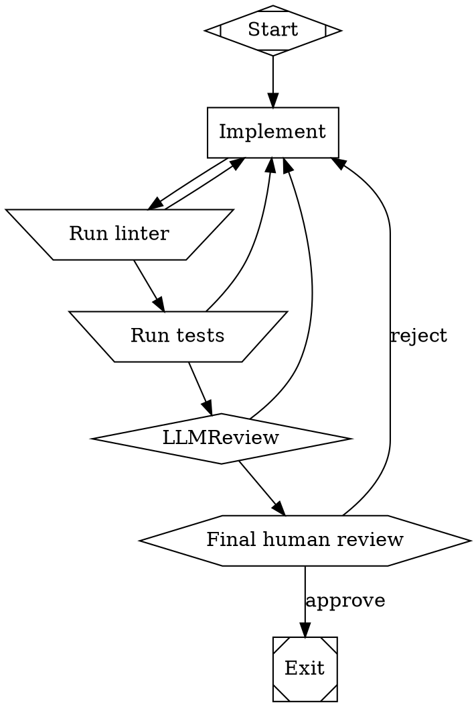

**How it works:** Four validation stages form a gauntlet. First, a tool node runs a linter (`invtrapezium` shape). If the linter fails, the pipeline returns to `Implement`. Next, a tool node runs tests. Then an LLM reviews for deeper issues the tools cannot catch. Finally, a human reviewer makes the ultimate decision.

Each stage catches a different class of defect. The linter catches syntax and style issues in milliseconds. Tests catch functional regressions. The LLM review catches architectural problems, security flaws, and edge cases. The human catches business logic errors and usability concerns.

Any failure at any stage sends the pipeline back to `Implement`. The implementation node sees accumulated feedback from all failed stages, so each revision addresses every known issue. This pattern is expensive -- four validation stages per iteration -- but it produces high-confidence output.

**Try it:**
```bash
uv run attractor validate multi-stage-validation.dot
uv run attractor run multi-stage-validation.dot --dry-run
```

---

### Recipe 20: Goal Gate with Retry Loop

**Problem:** I want automatic retry when quality checks fail.

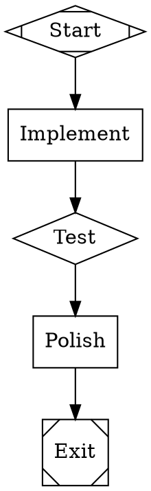

**How it works:** The `Test` node is both a conditional node and a goal gate. As a conditional node, it routes based on its outcome: success goes to `Polish`. As a goal gate, it is checked again at exit time. If `Test` passed during traversal but some later corruption invalidated the result, the exit check catches it.

The `retry_target="Implement"` tells the engine where to jump when the goal gate fails at exit. The engine does not exit; it redirects to `Implement` and the pipeline re-executes from there. This creates an automatic retry loop without explicit back-edges in the graph.

The difference from Recipe 15 is timing. Recipe 15 has no downstream nodes after the gate -- the gate feeds directly into exit. This recipe has a `Polish` step between the gate and exit. The goal gate still enforces quality at the boundary, even though the pipeline did additional work after passing the gate.

**Try it:**
```bash
uv run attractor validate goal-gate-retry.dot
uv run attractor run goal-gate-retry.dot --dry-run
```

---

### Recipe 21: Fidelity Control for Evaluation

**Problem:** My evaluation node needs to see everything that happened.

```dot
digraph FidelityControl {
    goal = "Write and validate a data migration script"
    default_fidelity = "compact"

    Start     [shape=Mdiamond label="Start"]
    Plan      [shape=box prompt="Plan the data migration for $goal."]
    Implement [shape=box prompt="Implement the migration script."]
    Judge     [shape=diamond prompt="Review the entire pipeline output. Check that the script matches the plan and handles all edge cases." fidelity="full"]
    Exit      [shape=Msquare label="Exit"]

    Start     -> Plan
    Plan      -> Implement
    Implement -> Judge
    Judge     -> Exit      [condition="outcome=success"]
    Judge     -> Implement [condition="outcome=fail"]
}
```

**How it works:** The graph sets `default_fidelity="compact"` so most nodes receive a condensed summary of prior context. The `Judge` node overrides this with `fidelity="full"`, meaning it receives the complete, untruncated output from every prior stage.

Fidelity resolution follows a precedence chain: edge fidelity beats node fidelity, node fidelity beats graph default, and graph default beats the system default of `compact`. The valid modes are `full`, `truncate`, `compact`, `summary:low`, `summary:medium`, and `summary:high`.

Full fidelity is expensive -- it passes all accumulated context to the LLM, consuming more tokens. Use it selectively on nodes that need complete information, like evaluation nodes or final review stages. Keep workhorse nodes on `compact` to reduce cost and latency.

**Try it:**
```bash
uv run attractor validate fidelity-control.dot
uv run attractor run fidelity-control.dot --dry-run
```

---

### Recipe 22: Model Stylesheet for Evaluation

**Problem:** I want to use my best model for quality evaluation.

```dot
digraph ModelStylesheet {
    goal = "Write a REST API with input validation"

    model_stylesheet = "
        * { llm_model: claude-sonnet-4-20250514; reasoning_effort: low; }
        .evaluator { llm_model: claude-opus-4-20250514; reasoning_effort: high; }
        #FinalReview { llm_model: claude-opus-4-20250514; reasoning_effort: high; }
    "

    Start       [shape=Mdiamond label="Start"]
    Plan        [shape=box prompt="Plan the REST API for $goal." class="worker"]
    Implement   [shape=box prompt="Implement the planned API." class="worker"]
    CodeReview  [shape=diamond prompt="Review the code for correctness and completeness." class="evaluator"]
    FinalReview [shape=diamond prompt="Final comprehensive review of the entire implementation."]
    Exit        [shape=Msquare label="Exit"]

    Start       -> Plan
    Plan        -> Implement
    Implement   -> CodeReview
    CodeReview  -> FinalReview [condition="outcome=success"]
    CodeReview  -> Implement   [condition="outcome=fail"]
    FinalReview -> Exit        [condition="outcome=success"]
    FinalReview -> Implement   [condition="outcome=fail"]
}
```

**How it works:** The `model_stylesheet` attribute uses CSS-like syntax with three selector types. The `*` selector sets defaults for all nodes: a fast Sonnet model with low reasoning effort. The `.evaluator` class selector overrides nodes tagged with `class="evaluator"`: they use Opus with high reasoning effort. The `#FinalReview` ID selector targets one specific node.

Specificity works like CSS: ID selectors (`#`) beat class selectors (`.`), which beat the universal selector (`*`). Within equal specificity, later rules win. A node's explicit attributes (set directly on the node) always override stylesheet values.

This pattern optimizes cost. The `Plan` and `Implement` nodes use a fast, cheap model because they are generative -- they benefit more from iteration than from raw model power. The evaluation nodes use the strongest available model because their judgment directly determines pipeline quality. A single pipeline can mix three or four models this way.

**Try it:**
```bash
uv run attractor validate model-stylesheet.dot
uv run attractor run model-stylesheet.dot --dry-run
```

---

## PRDs & Design Specs

### Recipe 23: External PRD

**Problem:** I wrote a PRD and want the pipeline to implement it.

```dot
digraph ExternalPRD {
    goal = "Implement the bookmark manager described in the PRD"

    Start     [shape=Mdiamond label="Start"]
    LoadPRD   [shape=box prompt="Read and summarize the following PRD:\n\n@file:prd.md\n\nExtract the key requirements, acceptance criteria, and technical constraints."]
    Implement [shape=box prompt="Implement the system described in the PRD summary. Follow every requirement exactly."]
    Validate  [shape=diamond prompt="Verify the implementation satisfies every acceptance criterion from the PRD."]
    Exit      [shape=Msquare label="Exit"]

    Start     -> LoadPRD
    LoadPRD   -> Implement
    Implement -> Validate
    Validate  -> Exit      [condition="outcome=success"]
    Validate  -> Implement [condition="outcome=fail"]
}
```

**How it works:** The `LoadPRD` node references an external file using `@file:prd.md` in its prompt. The engine expands this to the file's contents at execution time. The node summarizes the PRD into structured requirements that flow into context for subsequent nodes.

Separating the PRD load from implementation serves two purposes. First, it lets the summarization node distill a long PRD into the key points, reducing token usage in later stages. Second, it creates a clean context entry that downstream nodes can reference without parsing the raw PRD.

The `Validate` node checks every acceptance criterion. If validation fails, the pipeline loops back to `Implement` with the validation feedback in context. The PRD summary persists across iterations because it entered the context in the `LoadPRD` stage.

**Try it:**
```bash
uv run attractor validate external-prd.dot
uv run attractor run external-prd.dot --dry-run
```

---

### Recipe 24: Generated PRD

**Problem:** I want the pipeline to write the PRD from my goal.

```dot
digraph GeneratedPRD {
    goal = "A mobile app for tracking daily water intake"

    Start     [shape=Mdiamond label="Start"]
    WritePRD  [shape=box prompt="Write a detailed PRD for $goal. Include: problem statement, user stories, acceptance criteria, technical requirements, and non-functional requirements."]
    Design    [shape=box prompt="Create a technical design document based on the PRD. Define architecture, data models, API contracts, and component breakdown."]
    Implement [shape=box prompt="Implement the system according to the design document."]
    Exit      [shape=Msquare label="Exit"]

    Start     -> WritePRD
    WritePRD  -> Design
    Design    -> Implement
    Implement -> Exit
}
```

**How it works:** The `WritePRD` node generates a complete PRD from just the goal string. The LLM produces a structured document with user stories, acceptance criteria, and technical constraints. This enters the context and flows downstream to `Design` and `Implement`.

This pattern is useful when you have an idea but not a formal specification. The pipeline itself does the specification work. The generated PRD becomes the contract that later stages implement against.

The quality of the generated PRD depends on the goal's specificity. A vague goal like "a website" produces a vague PRD. A specific goal like "a mobile app for tracking daily water intake with reminders and weekly summaries" gives the LLM enough to produce actionable requirements. Front-load detail into the goal to get a better PRD.

**Try it:**
```bash
uv run attractor validate generated-prd.dot
uv run attractor run generated-prd.dot --dry-run
```

---

### Recipe 25: Full Lifecycle

**Problem:** I want a complete product development pipeline.

```dot
digraph FullLifecycle {
    goal = "A command-line expense tracker with CSV export"

    model_stylesheet = "
        * { llm_model: claude-sonnet-4-20250514; }
        .evaluator { llm_model: claude-opus-4-20250514; reasoning_effort: high; }
    "

    Start     [shape=Mdiamond label="Start"]
    PRD       [shape=box prompt="Write a PRD for $goal. Include user stories, acceptance criteria, and technical constraints."]
    Design    [shape=box prompt="Create a technical design from the PRD. Define modules, data flow, and interfaces."]
    Implement [shape=box prompt="Implement the design. Write production-ready code with error handling."]
    Test      [shape=diamond prompt="Review and test the implementation against every acceptance criterion in the PRD." class="evaluator" goal_gate=true retry_target="Implement"]
    Exit      [shape=Msquare label="Exit"]

    Start     -> PRD
    PRD       -> Design
    Design    -> Implement
    Implement -> Test
    Test      -> Exit [condition="outcome=success"]
}
```

**How it works:** Five stages mirror a real product development cycle: requirements, design, implementation, and validation. The `PRD` node produces specifications. `Design` translates them into architecture. `Implement` writes the code. `Test` validates against the original acceptance criteria.

The `Test` node is a goal gate with `retry_target="Implement"`. If validation fails at exit, the engine loops back to `Implement` automatically. The model stylesheet assigns the evaluator a stronger model so it catches real defects rather than rubber-stamping the implementation.

This pipeline produces a complete artifact from a single goal string. The key insight is that each stage constrains the next: the PRD constrains the design, the design constrains the implementation, and the test validates against the PRD. This chain of constraints prevents drift between what was requested and what was built.

**Try it:**
```bash
uv run attractor validate full-lifecycle.dot
uv run attractor run full-lifecycle.dot --dry-run
```

---

### Recipe 26: Human Review of Generated PRD

**Problem:** I want to review and approve the PRD before implementation starts.

```dot
digraph HumanPRDReview {
    goal = "An internal dashboard for monitoring pipeline health"

    Start     [shape=Mdiamond label="Start"]
    WritePRD  [shape=box prompt="Write a PRD for $goal."]
    ReviewPRD [shape=hexagon label="Review the generated PRD"]
    Design    [shape=box prompt="Design the system based on the approved PRD."]
    Implement [shape=box prompt="Implement the design."]
    Exit      [shape=Msquare label="Exit"]

    Start     -> WritePRD
    WritePRD  -> ReviewPRD
    ReviewPRD -> Design    [label="[A] Approve"]
    ReviewPRD -> WritePRD  [label="[R] Revise"]
    ReviewPRD -> Exit      [label="[X] Cancel"]
    Design    -> Implement
    Implement -> Exit
}
```

**How it works:** The `ReviewPRD` hexagon pauses the pipeline and presents the generated PRD to a human. The reviewer has three options: approve and continue, send it back for revision, or cancel the pipeline entirely.

This pattern combines Recipe 24 (generated PRD) with Recipe 10 (multi-option review). The LLM generates the PRD, but a human makes the go/no-go decision. The revision loop lets the reviewer iterate on the PRD until it is right before committing to implementation.

Human review of generated PRDs is valuable because the PRD shapes everything downstream. A flawed PRD produces a flawed design and implementation. Catching errors at the PRD stage is far cheaper than catching them after implementation -- a principle that holds for AI pipelines just as it does for traditional software projects.

**Try it:**
```bash
uv run attractor validate human-prd-review.dot
uv run attractor run human-prd-review.dot --dry-run
```

---

### Recipe 27: Design Spec Iteration

**Problem:** I want the design to be refined until it meets quality standards.

```dot
digraph DesignIteration {
    goal = "A plugin system with hot-reload support"

    Start       [shape=Mdiamond label="Start"]
    PRD         [shape=box prompt="Write a PRD for $goal."]
    Design      [shape=box prompt="Create a technical design document from the PRD. Include architecture diagrams, component interfaces, and data flow."]
    ReviewDesign [shape=diamond prompt="Evaluate the design for completeness, feasibility, and alignment with the PRD. Return success only if the design is implementation-ready." goal_gate=true retry_target="Design"]
    Implement   [shape=box prompt="Implement the approved design."]
    Exit        [shape=Msquare label="Exit"]

    Start        -> PRD
    PRD          -> Design
    Design       -> ReviewDesign
    ReviewDesign -> Implement [condition="outcome=success"]
    ReviewDesign -> Design   [condition="outcome=fail"]
    Implement    -> Exit
}
```

**How it works:** The `ReviewDesign` node evaluates the design against the PRD. If the design is incomplete, infeasible, or misaligned, it fails and the pipeline loops back to `Design`. The `Design` node sees the review criticism in context and produces a revised design.

The goal gate on `ReviewDesign` adds a second layer of enforcement. Even if the design passes on the first check and the pipeline proceeds through `Implement`, the exit check verifies the design gate is still satisfied. Combined with `retry_target="Design"`, this means a design failure at any point sends the pipeline back to the design stage.

This pattern is especially useful for complex systems where the design phase matters. A plugin system with hot-reload, for example, has subtle architectural requirements (isolation, versioning, state management) that an LLM might miss on the first attempt. Iterating on the design before implementation saves expensive implementation cycles.

**Try it:**
```bash
uv run attractor validate design-iteration.dot
uv run attractor run design-iteration.dot --dry-run
```

---

## Parallel Execution

### Recipe 28: Fan-Out / Fan-In

**Problem:** I want to run multiple tasks at the same time.

```dot
digraph FanOutFanIn {
    goal = "Build a microservices application"

    Start     [shape=Mdiamond label="Start"]
    Plan      [shape=box prompt="Break $goal into three independent services."]
    Parallel  [shape=component label="Build services" join_policy="wait_all"]
    ServiceA  [shape=box label="Build auth service"]
    ServiceB  [shape=box label="Build user service"]
    ServiceC  [shape=box label="Build data service"]
    Merge     [shape=tripleoctagon label="Select best results"]
    Integrate [shape=box label="Integrate all services"]
    Exit      [shape=Msquare label="Exit"]

    Start    -> Plan
    Plan     -> Parallel
    Parallel -> ServiceA
    Parallel -> ServiceB
    Parallel -> ServiceC
    ServiceA -> Merge
    ServiceB -> Merge
    ServiceC -> Merge
    Merge    -> Integrate
    Integrate -> Exit
}
```

**How it works:** The `Parallel` node uses shape `component`, which tells the engine to fan out to all its outgoing edges concurrently. `ServiceA`, `ServiceB`, and `ServiceC` execute at the same time. The `Merge` node uses shape `tripleoctagon`, which is the fan-in point -- it waits for all branches to complete, then selects the best results.

The `join_policy="wait_all"` attribute on the parallel node tells the engine to wait for every branch to finish before proceeding. The fan-in handler ranks branch results by status (success > partial > fail) and score, then sets `parallel.fan_in.best_id` in context.

Fan-out/fan-in is the primary mechanism for parallelism in Attractor. Use it when tasks are independent and can run concurrently. The `max_parallel` attribute (default 4) limits how many branches execute simultaneously if you need to throttle resource usage.

**Try it:**
```bash
uv run attractor validate fan-out-fan-in.dot
uv run attractor run fan-out-fan-in.dot --dry-run
```

---

### Recipe 29: K-of-N Join

**Problem:** I need at least some branches to succeed, but not all.

```dot
digraph KOfNJoin {
    goal = "Collect data from multiple unreliable sources"

    Start    [shape=Mdiamond label="Start"]
    Parallel [shape=component label="Fetch data" join_policy="k_of_n" k=2]
    SourceA  [shape=box label="Fetch from API Alpha"]
    SourceB  [shape=box label="Fetch from API Beta"]
    SourceC  [shape=box label="Fetch from API Gamma"]
    Merge    [shape=tripleoctagon label="Combine results"]
    Report   [shape=box label="Generate report from collected data"]
    Exit     [shape=Msquare label="Exit"]

    Start    -> Parallel
    Parallel -> SourceA
    Parallel -> SourceB
    Parallel -> SourceC
    SourceA  -> Merge
    SourceB  -> Merge
    SourceC  -> Merge
    Merge    -> Report
    Report   -> Exit
}
```

**How it works:** The `join_policy="k_of_n"` with `k=2` tells the engine to consider the parallel stage successful if at least 2 of the 3 branches succeed. If only 1 succeeds, the parallel node returns `FAIL`.

This is essential for unreliable operations. When fetching from external APIs, some sources may be temporarily unavailable. Requiring all sources to succeed makes the pipeline fragile. Requiring at least K successes gives you resilience while still ensuring enough data for a useful result.

The fan-in node receives results from all branches, including the failed ones. The `parallel.results` context entry contains a JSON array with each branch's status, notes, and score. Downstream nodes can inspect this to understand which sources contributed and which failed.

**Try it:**
```bash
uv run attractor validate k-of-n.dot
uv run attractor run k-of-n.dot --dry-run
```

---

### Recipe 30: First-Success Join

**Problem:** I want the fastest successful result.

```dot
digraph FirstSuccess {
    goal = "Translate a document"

    Start     [shape=Mdiamond label="Start"]
    Parallel  [shape=component label="Translate" join_policy="first_success"]
    MethodA   [shape=box label="Translate with approach A: literal"]
    MethodB   [shape=box label="Translate with approach B: idiomatic"]
    MethodC   [shape=box label="Translate with approach C: creative"]
    Merge     [shape=tripleoctagon label="Take first success"]
    Polish    [shape=box label="Polish the selected translation"]
    Exit      [shape=Msquare label="Exit"]

    Start    -> Parallel
    Parallel -> MethodA
    Parallel -> MethodB
    Parallel -> MethodC
    MethodA  -> Merge
    MethodB  -> Merge
    MethodC  -> Merge
    Merge    -> Polish
    Polish   -> Exit
}
```

**How it works:** With `join_policy="first_success"`, the parallel node succeeds as soon as any one branch returns success. The engine does not wait for the remaining branches to finish.

This pattern is useful when you have multiple strategies for the same task and want the fastest viable result. All three translation approaches run concurrently. Whichever finishes first with a success status wins. The slower branches are effectively abandoned.

The fan-in handler still records all completed results, so the `Polish` node can see which approach was selected via `parallel.fan_in.best_id`. If all branches fail, the parallel node returns `FAIL`. First-success join trades completeness for speed -- you get one good result fast rather than waiting for all results.

**Try it:**
```bash
uv run attractor validate first-success.dot
uv run attractor run first-success.dot --dry-run
```

---

### Recipe 31: Error Policy

**Problem:** I want to control what happens when a parallel branch fails.

```dot
digraph ErrorPolicy {
    goal = "Run a critical data pipeline"

    Start       [shape=Mdiamond label="Start"]
    FailFast    [shape=component label="Critical checks" join_policy="wait_all" error_policy="fail_fast"]
    CheckA      [shape=box label="Validate data integrity"]
    CheckB      [shape=box label="Validate schema compliance"]
    CheckC      [shape=box label="Validate business rules"]
    MergeFast   [shape=tripleoctagon label="All checks passed"]
    Tolerant    [shape=component label="Optional enrichments" join_policy="wait_all" error_policy="continue"]
    EnrichA     [shape=box label="Add geolocation data"]
    EnrichB     [shape=box label="Add sentiment scores"]
    MergeTolerant [shape=tripleoctagon label="Merge available enrichments"]
    Exit        [shape=Msquare label="Exit"]

    Start      -> FailFast
    FailFast   -> CheckA
    FailFast   -> CheckB
    FailFast   -> CheckC
    CheckA     -> MergeFast
    CheckB     -> MergeFast
    CheckC     -> MergeFast
    MergeFast  -> Tolerant
    Tolerant   -> EnrichA
    Tolerant   -> EnrichB
    EnrichA    -> MergeTolerant
    EnrichB    -> MergeTolerant
    MergeTolerant -> Exit
}
```

**How it works:** Two parallel stages demonstrate the two error policies. The first stage uses `error_policy="fail_fast"`: if any validation check fails, the engine cancels the remaining branches immediately and the parallel node fails. This is appropriate for critical checks where one failure invalidates the whole batch.

The second stage uses `error_policy="continue"` (the default): even if geolocation enrichment fails, the engine lets sentiment scoring finish. The parallel node returns `PARTIAL_SUCCESS` with however many branches succeeded. This is appropriate for optional or best-effort work.

Choose `fail_fast` when all branches must succeed and a single failure means the overall task is invalid. Choose `continue` when partial results are acceptable and you want to salvage as much work as possible. The two policies can coexist in the same pipeline, applied to different parallel stages.

**Try it:**
```bash
uv run attractor validate error-policy.dot
uv run attractor run error-policy.dot --dry-run
```

---

## Configuration & Scaling

### Recipe 32: Model Stylesheet

**Problem:** I want different LLM models for different kinds of work.

```dot
digraph FullStylesheet {
    goal = "Build and review a data pipeline"

    model_stylesheet = "
        * { llm_model: claude-haiku-3-20250307; reasoning_effort: low; }
        .drafter { llm_model: claude-sonnet-4-20250514; reasoning_effort: medium; }
        .reviewer { llm_model: claude-opus-4-20250514; reasoning_effort: high; }
        #Architect { llm_model: claude-opus-4-20250514; reasoning_effort: high; }
    "

    Start     [shape=Mdiamond label="Start"]
    Outline   [shape=box label="Outline the pipeline" class="drafter"]
    Architect [shape=box prompt="Design the architecture for $goal."]
    Implement [shape=box label="Implement the pipeline" class="drafter"]
    Review    [shape=diamond label="Review the implementation" class="reviewer"]
    Summarize [shape=box label="Write a summary"]
    Exit      [shape=Msquare label="Exit"]

    Start     -> Outline
    Outline   -> Architect
    Architect -> Implement
    Implement -> Review
    Review    -> Exit      [condition="outcome=success"]
    Review    -> Implement [condition="outcome=fail"]
    Summarize -> Exit
}
```

**How it works:** The model stylesheet demonstrates all three selector types in one pipeline. The universal selector (`*`) assigns Haiku with low reasoning to every node as a baseline. The `.drafter` class selector upgrades `Outline` and `Implement` to Sonnet with medium reasoning. The `.reviewer` class selector assigns Opus with high reasoning to `Review`. The `#Architect` ID selector targets one specific node with Opus.

Specificity determines which rule wins when multiple selectors match a node. ID selectors (specificity 2) beat class selectors (specificity 1), which beat the universal selector (specificity 0). Within equal specificity, the later declaration wins. Explicit node attributes always override the stylesheet entirely.

This three-tier model allocation is a practical cost optimization. Cheap models handle routine tasks (summarization, outlining). Mid-tier models handle generative work (drafting, implementing). Top-tier models handle judgment calls (review, architecture). A pipeline that uses Opus everywhere costs 10-20x more than one that reserves Opus for evaluation.

**Try it:**
```bash
uv run attractor validate full-stylesheet.dot
uv run attractor run full-stylesheet.dot --dry-run
```

---

### Recipe 33: Subgraph Classes

**Problem:** I want to apply the same settings to a group of nodes.

```dot
digraph SubgraphClasses {
    goal = "Build a web application"

    model_stylesheet = "
        * { llm_model: claude-sonnet-4-20250514; }
        .backend { llm_model: claude-opus-4-20250514; reasoning_effort: high; }
        .frontend { llm_model: claude-sonnet-4-20250514; reasoning_effort: medium; }
    "

    Start [shape=Mdiamond label="Start"]

    subgraph cluster_backend {
        label = "Backend"
        class = "backend"
        API     [shape=box label="Build REST API"]
        DB      [shape=box label="Design database schema"]
        Auth    [shape=box label="Implement authentication"]
    }

    subgraph cluster_frontend {
        label = "Frontend"
        class = "frontend"
        UI      [shape=box label="Build UI components"]
        Routing [shape=box label="Set up routing"]
    }

    Integrate [shape=box label="Integration testing"]
    Exit      [shape=Msquare label="Exit"]

    Start   -> API
    Start   -> UI
    API     -> DB
    DB      -> Auth
    Auth    -> Integrate
    UI      -> Routing
    Routing -> Integrate
    Integrate -> Exit
}
```

**How it works:** Subgraphs (clusters in DOT syntax) group related nodes. The `class` attribute on a subgraph assigns that class to every node inside it. The `API`, `DB`, and `Auth` nodes all inherit the `backend` class. The `UI` and `Routing` nodes inherit `frontend`.

The model stylesheet then targets these classes. All backend nodes get Opus with high reasoning. All frontend nodes get Sonnet with medium reasoning. Adding a new backend node to the subgraph automatically gives it the right model -- no need to set the class on each node individually.

Subgraph classes work with thread IDs too. The fidelity resolver checks a node's subgraph and its `derived_class` to determine the thread ID. Nodes in the same subgraph can share a conversation thread, giving them continuity across the group without explicit `thread_id` attributes on each node.

**Try it:**
```bash
uv run attractor validate subgraph-classes.dot
uv run attractor run subgraph-classes.dot --dry-run
```

---

### Recipe 34: Context Fidelity Modes

**Problem:** I want to control how much context flows between stages.

```dot
digraph FidelityModes {
    goal = "Write, review, and summarize a research paper"
    default_fidelity = "compact"

    Start     [shape=Mdiamond label="Start"]
    Research  [shape=box label="Research the topic" fidelity="full"]
    Draft     [shape=box label="Write the first draft"]
    Review    [shape=diamond label="Peer review" fidelity="full"]
    Revise    [shape=box label="Revise based on review"]
    Summarize [shape=box label="Write executive summary" fidelity="summary:high"]
    Exit      [shape=Msquare label="Exit"]

    Start     -> Research
    Research  -> Draft
    Draft     -> Review
    Review    -> Revise   [condition="outcome=fail"]
    Review    -> Summarize [condition="outcome=success"]
    Revise    -> Review
    Summarize -> Exit
}
```

**How it works:** Six fidelity modes control how much prior context a node receives. `full` passes everything -- every prior stage's complete output. `truncate` passes everything but trims long outputs to a token limit. `compact` (the default) passes a condensed representation. `summary:low`, `summary:medium`, and `summary:high` pass AI-generated summaries at varying levels of detail.

In this pipeline, `Research` uses `full` fidelity because it needs to see any prior context completely. `Draft` uses the graph default (`compact`) because it only needs the key points from the research. `Review` uses `full` because a thorough review requires seeing the entire draft. `Summarize` uses `summary:high` because it needs a detailed summary of the paper, not the raw text.

Fidelity can also be set on edges. An edge's fidelity overrides the target node's fidelity for that specific transition. This lets you fine-tune context flow for individual paths: a revision edge might carry `full` fidelity while the happy path carries `compact`.

**Try it:**
```bash
uv run attractor validate fidelity-modes.dot
uv run attractor run fidelity-modes.dot --dry-run
```

---

### Recipe 35: Thread IDs

**Problem:** I want related stages to share the same conversation.

```dot
digraph ThreadIDs {
    goal = "Build a CLI application"

    Start     [shape=Mdiamond label="Start"]
    Plan      [shape=box prompt="Plan the CLI application for $goal." thread_id="design"]
    Design    [shape=box prompt="Design the module structure and interfaces." thread_id="design"]
    ImplCore  [shape=box prompt="Implement the core logic." thread_id="impl"]
    ImplCLI   [shape=box prompt="Implement the CLI interface." thread_id="impl"]
    Test      [shape=diamond prompt="Test the complete application." thread_id="qa"]
    Fix       [shape=box prompt="Fix the failing tests." thread_id="impl"]
    Exit      [shape=Msquare label="Exit"]

    Start    -> Plan
    Plan     -> Design
    Design   -> ImplCore
    ImplCore -> ImplCLI
    ImplCLI  -> Test
    Test     -> Exit [condition="outcome=success"]
    Test     -> Fix  [condition="outcome=fail"]
    Fix      -> Test
}
```

**How it works:** The `thread_id` attribute groups nodes into conversation threads. `Plan` and `Design` share thread `"design"`, so `Design` sees the full conversation history from `Plan` as if they were one continuous session. `ImplCore`, `ImplCLI`, and `Fix` share thread `"impl"`. `Test` has its own thread `"qa"`.

Thread IDs enable session reuse with LLM providers that support stateful conversations. Instead of rebuilding context from scratch at each node, the engine resumes an existing conversation. This reduces token usage (no repeated context) and improves coherence (the LLM remembers what it said earlier in the thread).

Thread resolution follows a precedence chain: node `thread_id` first, then edge `thread_id`, then subgraph `derived_class`, then the previous node's ID. In most cases, setting `thread_id` on the node is sufficient. Edge-level thread IDs are useful when the same node participates in different threads depending on which path led to it.

**Try it:**
```bash
uv run attractor validate thread-ids.dot
uv run attractor run thread-ids.dot --dry-run
```

---

## Operations

### Recipe 36: Checkpoint and Resume

**Problem:** My pipeline crashed and I want to pick up where it left off.

The pipeline is a standard .dot file. Checkpointing is enabled by default in the engine:

```dot
digraph LongPipeline {
    goal = "Process a large dataset"

    Start   [shape=Mdiamond label="Start"]
    Fetch   [shape=box label="Fetch the dataset"]
    Clean   [shape=box label="Clean and normalize"]
    Analyze [shape=box label="Run analysis"]
    Report  [shape=box label="Generate report"]
    Exit    [shape=Msquare label="Exit"]

    Start   -> Fetch
    Fetch   -> Clean
    Clean   -> Analyze
    Analyze -> Report
    Report  -> Exit
}
```

Resume from a checkpoint in Python:

```python
from attractor.checkpoint import Checkpoint
from attractor.engine import EngineConfig, PipelineEngine
from attractor.parser import parse_dot

# Load the checkpoint saved by a previous run
checkpoint = Checkpoint.load("/tmp/attractor-run/checkpoint.json")
print(f"Resuming from node: {checkpoint.current_node}")
print(f"Completed: {checkpoint.completed_nodes}")

# Parse the same graph
with open("long-pipeline.dot") as f:
    graph = parse_dot(f.read())

# Resume execution
engine = PipelineEngine(EngineConfig(logs_root="/tmp/attractor-run"))
import asyncio
outcome = asyncio.run(engine.run(graph, resume_from=checkpoint))
```

**How it works:** The engine saves a checkpoint after every node completes. The checkpoint file (`checkpoint.json` in the logs directory) contains the current node, completed nodes, retry counts, and the full context snapshot.

To resume, load the checkpoint with `Checkpoint.load()` and pass it to `engine.run()` as the `resume_from` parameter. The engine restores the context, skips completed nodes, and resumes execution from the edge after the checkpoint node. The pipeline continues as if it never stopped.

Checkpoints are JSON files, so you can inspect them manually. The `context` field shows all accumulated context values, `completed_nodes` lists what finished, and `node_retries` tracks retry counts. This transparency helps debug crashed pipelines -- you can see exactly what state the pipeline was in when it stopped.

**Try it:**
```bash
uv run attractor validate long-pipeline.dot
uv run attractor run long-pipeline.dot --dry-run
```

---

### Recipe 37: HTTP Server with SSE

**Problem:** I want to run pipelines via HTTP and monitor events.

No .dot file changes are needed. The Attractor server wraps any pipeline for HTTP access:

```bash
# Start the server
uvicorn attractor.server:app --host 0.0.0.0 --port 8000

# Submit a pipeline
curl -X POST http://localhost:8000/pipelines \
  -H "Content-Type: application/json" \
  -d '{
    "dot_source": "digraph P { Start [shape=Mdiamond]; Task [shape=box label=\"Hello\"]; Exit [shape=Msquare]; Start -> Task -> Exit; }",
    "goal": "Say hello"
  }'
# Returns: {"id": "a1b2c3d4", "status": "running"}

# Stream events via SSE
curl -N http://localhost:8000/pipelines/a1b2c3d4/events
# Streams: data: {"kind": "node.start", "node_id": "Task", "data": {}}
#          data: {"kind": "node.complete", "node_id": "Task", "data": {"status": "success"}}
#          data: {"kind": "done", "status": "completed"}

# Check status
curl http://localhost:8000/pipelines/a1b2c3d4

# Get graph info
curl http://localhost:8000/pipelines/a1b2c3d4/graph

# Cancel a pipeline
curl -X POST http://localhost:8000/pipelines/a1b2c3d4/cancel
```

**How it works:** The Attractor server is a FastAPI application that exposes pipelines over HTTP. `POST /pipelines` accepts a DOT source string, parses and validates it, then runs the pipeline in the background. The response includes a pipeline ID for subsequent requests.

`GET /pipelines/{id}/events` returns a Server-Sent Events (SSE) stream. The server polls the engine's event list and sends each new event as an SSE message. The stream ends with a `done` event when the pipeline completes, fails, or errors. Use `curl -N` (no buffering) to see events in real time.

Other endpoints let you inspect pipeline status (`GET /pipelines/{id}`), view the graph structure (`GET /pipelines/{id}/graph`), and cancel running pipelines (`POST /pipelines/{id}/cancel`). The server stores pipelines in memory, so restarting the server loses all state. For production use, combine with checkpointing to persist pipeline state to disk.

**Try it:**
```bash
pip install uvicorn fastapi
uvicorn attractor.server:app --port 8000
```

---

### Recipe 38: Custom Codergen Backend

**Problem:** I want to use my own LLM integration.

This recipe is entirely programmatic. The .dot file is unchanged -- any standard pipeline works:

```python
from attractor.context import Context
from attractor.engine import EngineConfig, PipelineEngine
from attractor.graph import Node
from attractor.outcome import Outcome, StageStatus
from attractor.parser import parse_dot
import asyncio


class MyBackend:
    """Custom LLM backend implementing the CodergenBackend protocol."""

    def __init__(self, api_key: str, model: str = "my-model"):
        self.api_key = api_key
        self.model = model

    async def run(self, node: Node, prompt: str, context: Context) -> str | Outcome:
        # Option 1: Return a string (engine wraps it in a success Outcome)
        # response = await my_llm_client.complete(prompt, model=self.model)
        # return response.text

        # Option 2: Return an Outcome for full control
        try:
            # response = await my_llm_client.complete(prompt, model=self.model)
            response_text = f"[{self.model}] Response for: {node.id}"
            return Outcome(
                status=StageStatus.SUCCESS,
                notes=response_text,
                context_updates={"last_model": self.model},
                preferred_label=None,  # Set this to influence edge selection
            )
        except Exception as e:
            return Outcome(
                status=StageStatus.FAIL,
                failure_reason=str(e),
            )


# Use the custom backend
backend = MyBackend(api_key="sk-...", model="gpt-4")
config = EngineConfig(codergen_backend=backend)
engine = PipelineEngine(config)

dot_source = """
digraph CustomBackend {
    Start [shape=Mdiamond label="Start"]
    Task  [shape=box label="Generate a poem"]
    Exit  [shape=Msquare label="Exit"]
    Start -> Task -> Exit
}
"""

graph = parse_dot(dot_source)
outcome = asyncio.run(engine.run(graph))
print(f"Result: {outcome.status.value}")
```

**How it works:** The `CodergenBackend` protocol requires a single method: `async def run(self, node: Node, prompt: str, context: Context) -> str | Outcome`. The engine calls this method for every `box`-shaped node. Return a string for simple cases (the engine wraps it in a success Outcome) or return an Outcome for full control over status, context updates, and edge selection.

Pass your backend to `EngineConfig(codergen_backend=backend)`. The engine injects it into the `CodergenHandler`, which handles prompt expansion, logging, and error handling. Your backend only needs to call the LLM and return the result.

This is the extension point for integrating any LLM provider: OpenAI, Anthropic, local models, or custom inference endpoints. The backend receives the full `Node` object (including `llm_model`, `llm_provider`, and other attributes), so you can use node-level configuration to route to different models or providers within a single pipeline.

**Try it:**
```bash
python custom_backend.py
```

---

### Recipe 39: Validation Before Execution

**Problem:** I want to catch errors before running a pipeline.

```python
from attractor.parser import parse_dot
from attractor.validator import validate_or_raise, validate, ValidationError
from attractor.transforms import VariableExpansionTransform, StylesheetTransform

dot_source = """
digraph MyPipeline {
    goal = "Build something"

    Start [shape=Mdiamond label="Start"]
    Plan  [shape=box prompt="Plan $goal."]
    Build [shape=box prompt="Build $goal."]
    Exit  [shape=Msquare label="Exit"]

    Start -> Plan -> Build -> Exit
}
"""

# Step 1: Parse
graph = parse_dot(dot_source)

# Step 2: Apply transforms (variable expansion, stylesheet)
graph = VariableExpansionTransform().apply(graph)
graph = StylesheetTransform().apply(graph)

# Step 3: Validate (non-throwing version for inspection)
diagnostics = validate(graph)
for d in diagnostics:
    print(f"[{d.severity}] {d.message}")

# Step 4: Validate (throwing version for fail-fast)
try:
    validate_or_raise(graph)
    print("Pipeline is valid.")
except ValidationError as e:
    print(f"Validation failed: {e}")
    # Fix the issue and try again

# Step 5: Run only if valid
from attractor.engine import EngineConfig, PipelineEngine
import asyncio

engine = PipelineEngine(EngineConfig(dry_run=True))
outcome = asyncio.run(engine.run(graph))
print(f"Dry-run result: {outcome.status.value}")
```

**How it works:** The validation pipeline has three stages: parse, transform, validate. Parsing converts the DOT source into a `Graph` object. Transforms expand variables (`$goal`) and apply model stylesheets. Validation checks structural rules: start and exit nodes exist, all nodes are reachable, conditions reference valid fields, and shapes are recognized.

The `validate()` function returns a list of `Diagnostic` objects with severity and message. Use this when you want to inspect all issues before deciding whether to proceed. The `validate_or_raise()` function throws a `ValidationError` on the first error-level diagnostic. Use this when any error should stop execution.

Combine validation with dry-run for a complete pre-flight check. Validation catches structural problems (missing nodes, invalid shapes). Dry-run catches execution-path problems (unreachable branches, infinite loops without exit). Together, they give you high confidence that the pipeline will run correctly before you spend tokens on LLM calls.

**Try it:**
```bash
uv run attractor validate my-pipeline.dot
uv run attractor run my-pipeline.dot --dry-run
```
