# Attractor Cookbook

Each recipe is self-contained: a problem, a complete .dot file, an explanation, and a command to try it.

---

## Basic Patterns

### Recipe 1: Linear Pipeline

**Problem:** I want the simplest possible pipeline.

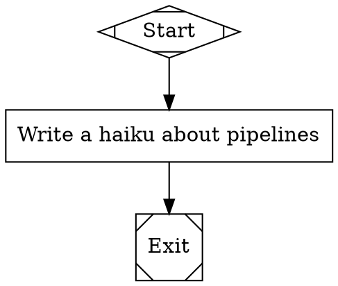

**How it works:** Three nodes connected in a straight line. `Start` (shape `Mdiamond`) marks the entry point. `Task` (shape `box`) sends its label to the LLM as a prompt. `Exit` (shape `Msquare`) marks the end.

The engine begins at `Start`, follows the single outgoing edge to `Task`, calls the LLM with the label text, then follows the edge to `Exit` and stops. No branching, no conditions, no loops.

This is the foundation for every Attractor pipeline. Add complexity only when you need it.

**Try it:**
```bash
uv run attractor validate linear.dot
uv run attractor run linear.dot --dry-run
```

---

### Recipe 2: Pipeline with Goal and Prompt Templates

**Problem:** I want to control what the LLM does at each step.

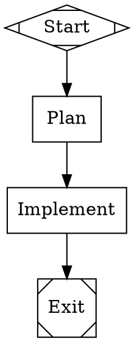

**How it works:** The `goal` attribute on the graph sets a project-wide objective. Each node uses a `prompt` attribute instead of relying on the label for the LLM instruction. Inside the prompt, `$goal` expands to the graph's goal string at load time.

This separation keeps labels short for display while giving the LLM detailed instructions. The `Plan` node receives "Create a detailed plan to Build a REST API for managing bookmarks..." as its full prompt. The `Implement` node gets its own tailored prompt with the same goal substituted in.

Use `prompt` whenever the label alone is not enough to direct the LLM. Use `$goal` to avoid repeating your project description in every node.

**Try it:**
```bash
uv run attractor validate goal-pipeline.dot
uv run attractor run goal-pipeline.dot --dry-run
```

---

### Recipe 3: Dry-Run for Testing Structure

**Problem:** I want to test my pipeline logic without incurring LLM costs.

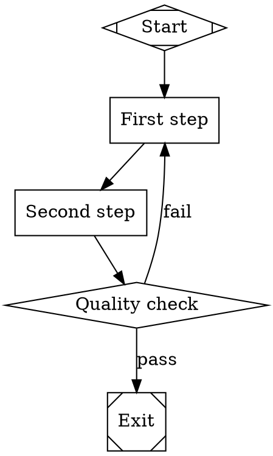

**How it works:** The `--dry-run` flag tells Attractor to walk the graph without calling any LLM. It validates structure (every node reachable, start and exit present, no orphan edges) and traces the execution path, reporting which nodes would run and in what order.

Dry-run catches structural errors early: missing start or exit nodes, unreachable nodes, malformed conditions, and invalid shapes. It costs nothing and runs in milliseconds.

Run `validate` first to check syntax, then `--dry-run` to trace execution. Make this part of your development loop: edit the .dot file, validate, dry-run, then run for real only when the structure is correct.

**Try it:**
```bash
uv run attractor validate dryrun.dot
uv run attractor run dryrun.dot --dry-run
```

---

## Branching & Routing

### Recipe 4: Binary Decision

**Problem:** I need different paths for success and failure.

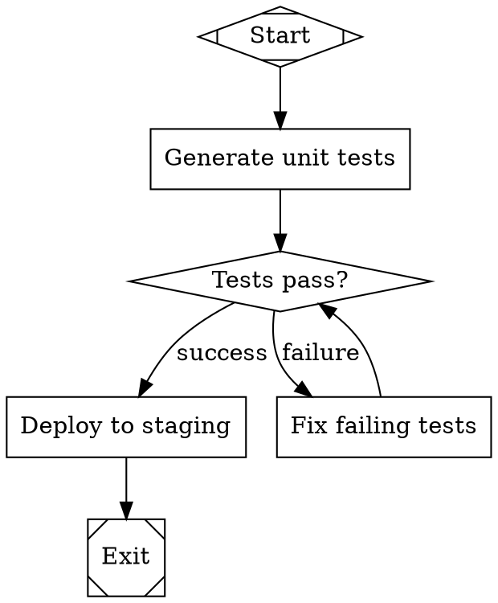

**How it works:** The `Check` node uses shape `diamond`, which makes it a conditional node. After the LLM evaluates the node, the engine inspects the outcome and evaluates each outgoing edge's `condition` attribute.

The condition `outcome=success` matches when the LLM reports success. The condition `outcome=fail` matches when it reports failure. Only one edge fires. If the tests fail, the pipeline routes to `Fix` and loops back to `Check` for another attempt.

Conditional nodes are the primary branching mechanism in Attractor. The `diamond` shape signals that this node exists to make a routing decision, not to produce output.

**Try it:**
```bash
uv run attractor validate binary-decision.dot
uv run attractor run binary-decision.dot --dry-run
```

---

### Recipe 5: Multi-Way Branch

**Problem:** I need more than two outcomes from a decision.

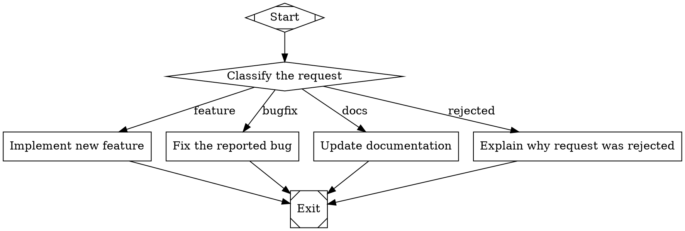

**How it works:** A diamond node can have any number of outgoing edges. Each edge has a distinct `condition` that checks a context value. The `Classify` node's LLM handler sets `context.request_type` in its outcome's `context_updates`, and the engine evaluates every outgoing edge's condition against the current context.

The engine evaluates conditions in order. When multiple conditions match, it picks the edge with the highest `weight` (defaulting to 0), then breaks ties lexically by target node ID. In practice, design your conditions to be mutually exclusive so exactly one fires.

You can extend this pattern to any number of branches. Add more edges with more conditions. There is no hard limit on outgoing edges from a conditional node.

**Try it:**
```bash
uv run attractor validate multi-branch.dot
uv run attractor run multi-branch.dot --dry-run
```

---

### Recipe 6: Weighted Edges

**Problem:** When multiple edges match, I want to control which one wins.

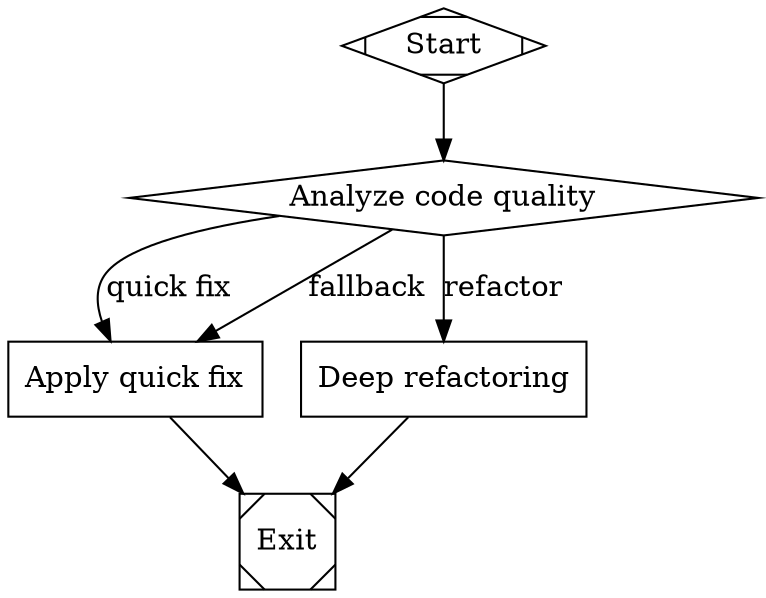

**How it works:** When the engine evaluates outgoing edges from a node, it first collects all edges whose conditions match. If more than one matches, it picks the edge with the highest `weight`. The default weight is 0.

In this example, when `Analyze` returns success, both the "quick fix" (weight 1) and "refactor" (weight 10) edges match. The engine picks "refactor" because weight 10 beats weight 1. If `Analyze` fails, only the "fallback" edge matches, so no weight comparison is needed.

Use weights to express preference among overlapping conditions. The pattern is particularly useful when you want a default path (low weight) and a preferred path (high weight) that share the same condition.

**Try it:**
```bash
uv run attractor validate weighted.dot
uv run attractor run weighted.dot --dry-run
```

---

### Recipe 7: Preferred Label Matching

**Problem:** I want the LLM to choose which path to follow.

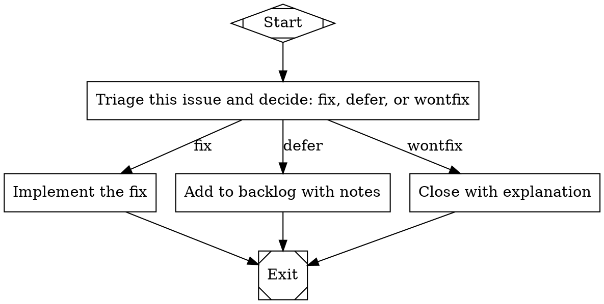

**How it works:** When a node's LLM handler returns an `Outcome` with a `preferred_label` field, the engine matches that value against the labels on outgoing edges. If the LLM sets `preferred_label = "defer"`, the engine follows the edge labeled "defer".

Label matching is case-insensitive and ignores accelerator key prefixes (like `[A]` or `K)`). The engine normalizes both the preferred label and edge labels before comparing.

This pattern differs from condition-based routing because the LLM itself decides the path. No conditions are needed on the edges -- just labels. The engine's routing priority is: (1) condition matches, (2) preferred label, (3) suggested next IDs, (4) weight and lexical tiebreak. Since these edges have no conditions, preferred label matching takes effect.

**Try it:**
```bash
uv run attractor validate preferred-label.dot
uv run attractor run preferred-label.dot --dry-run
```

---

### Recipe 8: Context-Based Conditions

**Problem:** I need routing based on data from earlier stages.

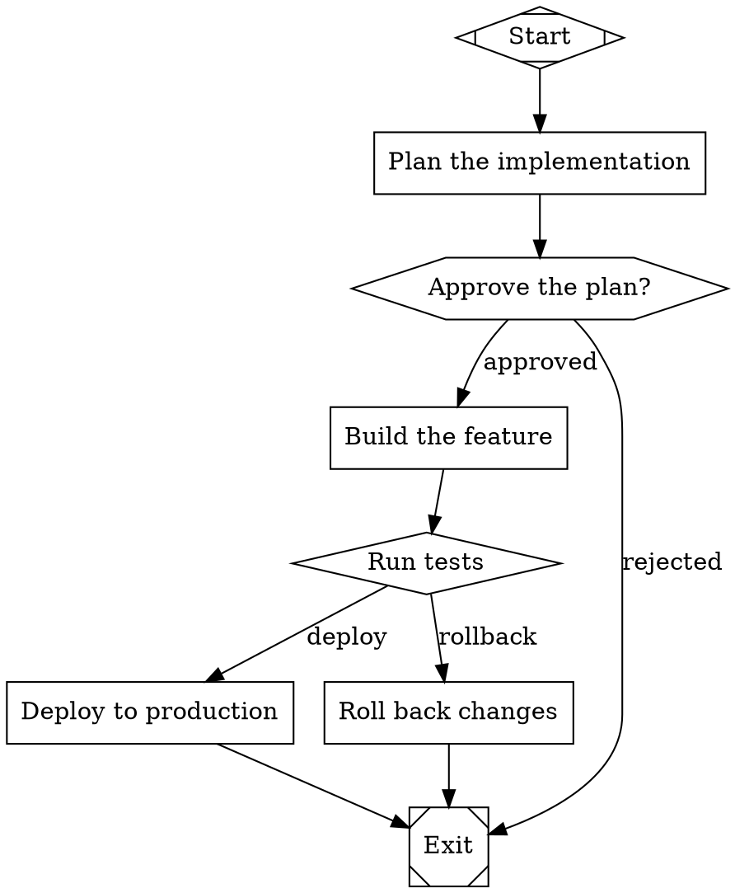

**How it works:** Conditions can reference values stored in the pipeline's shared context using the `context.` prefix. In this example, the `Test` node's "deploy" edge requires both `context.approval=granted` and `outcome=success`. The `&&` operator combines multiple clauses -- all must be true for the edge to match.

Context values are set by earlier nodes through their outcome's `context_updates` dictionary. The `Approve` node might set `context.approval = "granted"` when the human approves. Later, the `Test` node's edge checks that value to confirm approval is still on record before deploying.

The condition evaluator supports three operators: `=` (equals), `!=` (not equals), and bare key checks (truthy). Combine clauses with `&&` for AND logic. This gives you enough power to route on any combination of outcome status and accumulated context data.

**Try it:**
```bash
uv run attractor validate context-conditions.dot
uv run attractor run context-conditions.dot --dry-run
```

---

## Human-in-the-Loop

### Recipe 9: Single Approval Gate

**Problem:** I need human sign-off before proceeding.

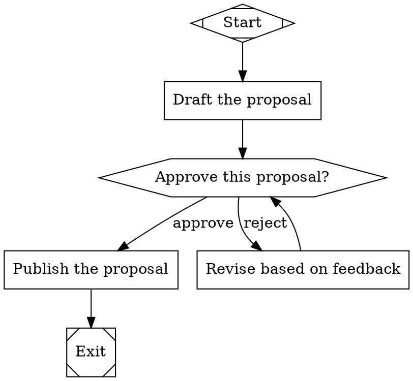

**How it works:** The `Review` node uses shape `hexagon`, which makes it a human gate. When the engine reaches this node, it pauses execution and presents the accumulated context to a human reviewer. The reviewer either approves (outcome = success) or rejects (outcome = fail).

The two outgoing edges use conditions to route based on the reviewer's decision. Approval proceeds to `Publish`. Rejection routes to `Revise`, which loops back to `Review` for another round.

Human gates are blocking: the pipeline waits indefinitely until the reviewer responds. In production, configure a `timeout` attribute on the node to set a maximum wait time.

**Try it:**
```bash
uv run attractor validate approval-gate.dot
uv run attractor run approval-gate.dot --dry-run
```

---

### Recipe 10: Multi-Option Review

**Problem:** I need the reviewer to choose from several actions.

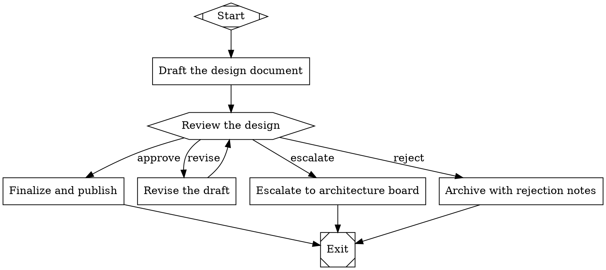

**How it works:** A hexagon node can have any number of outgoing edges, each representing a distinct reviewer action. The engine presents these as options to the human. The reviewer's selection sets `preferred_label` on the outcome, and the engine matches it against the edge labels.

No `condition` attributes are needed here. The edges use only labels, and the engine's preferred-label matching handles the routing. This keeps the .dot file clean when the human is making a free choice rather than the pipeline evaluating data.

The `Revise` path loops back to `Review`, letting the reviewer iterate as many times as needed. The other paths are terminal -- they proceed to `Exit` after one step.

**Try it:**
```bash
uv run attractor validate multi-option.dot
uv run attractor run multi-option.dot --dry-run
```

---

### Recipe 11: Accelerator Keys

**Problem:** I want keyboard shortcuts for faster review.

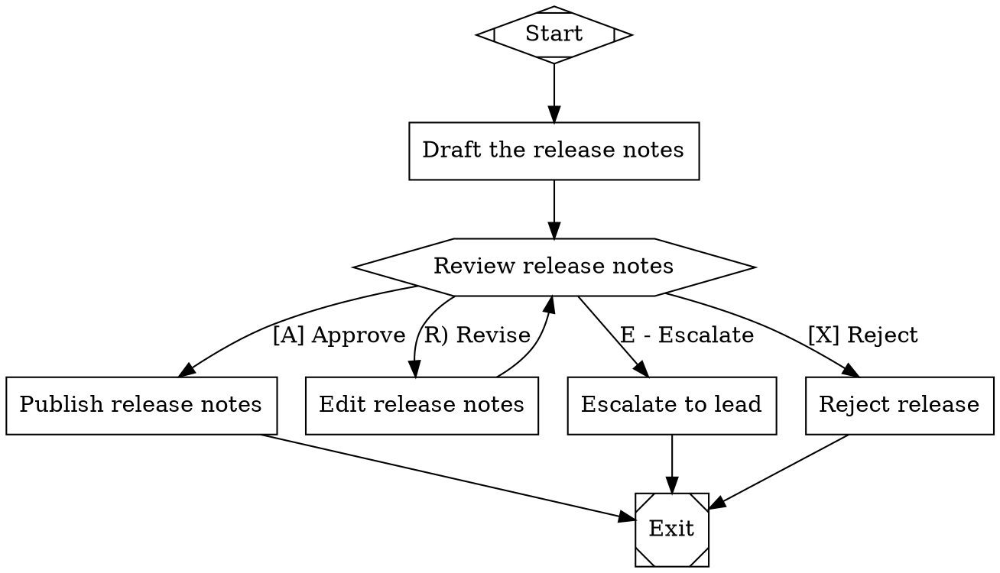

**How it works:** Edge labels can embed accelerator keys using three patterns: `[K] Label`, `K) Label`, or `K - Label`. The engine's `parse_accelerator_key` function extracts the key character. At the terminal, the reviewer presses a single key instead of typing the full label.

The engine normalizes labels before matching. When the reviewer presses `A`, the engine strips the `[A]` prefix from "[A] Approve" and compares the normalized form. This means the LLM's preferred-label matching also works: a preferred label of "approve" matches "[A] Approve" after normalization.

Mix accelerator formats freely. The three formats (`[K]`, `K)`, `K -`) are equivalent -- choose whichever reads best for your use case. If no accelerator prefix is present, the engine uses the label's first character as the default key.

**Try it:**
```bash
uv run attractor validate accelerators.dot
uv run attractor run accelerators.dot --dry-run
```

---

### Recipe 12: Recording Decisions for Audit

**Problem:** I need an audit trail of all human decisions.

This recipe is programmatic. You configure the `RecordingInterviewer` in Python code rather than in the .dot file. The pipeline itself is a standard human-gate pipeline:

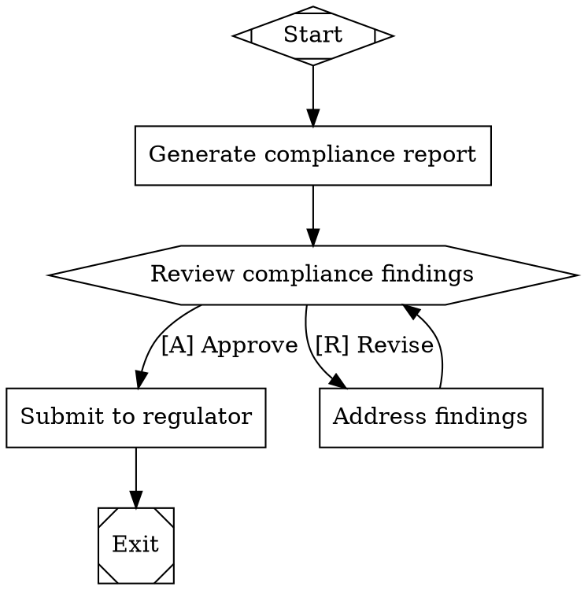

Wrap your interviewer with `RecordingInterviewer` to capture every question and answer:

```python
from attractor.interviewer import RecordingInterviewer, TerminalInterviewer

# Create the base interviewer (the one that actually talks to the human)
terminal = TerminalInterviewer()

# Wrap it with RecordingInterviewer to capture all interactions
recorder = RecordingInterviewer(inner=terminal)

# Pass the recorder to the engine configuration
# engine = Engine(config=EngineConfig(interviewer=recorder))

# After the pipeline completes, access the audit log:
for question, answer in recorder.recordings:
    print(f"Stage: {question.stage}")
    print(f"Question: {question.text}")
    print(f"Answer: {answer.value}")
    print("---")
```

**How it works:** `RecordingInterviewer` is a decorator that wraps any interviewer implementation. It delegates every `ask` and `ask_multiple` call to the inner interviewer, then stores the `(Question, Answer)` pair in its `recordings` list.

The recordings capture the full question object (including the stage name, question type, and available options) and the full answer object (including the selected option and freeform text). This gives you a complete audit trail without modifying the pipeline graph or the review workflow.

For persistent storage, iterate over `recorder.recordings` after the pipeline completes and write the entries to your audit system -- a database, a JSON file, or a compliance log. The `question.stage` field tells you which pipeline node triggered the interaction.

**Try it:**
```bash
uv run attractor validate audit-trail.dot
uv run attractor run audit-trail.dot --dry-run
```
