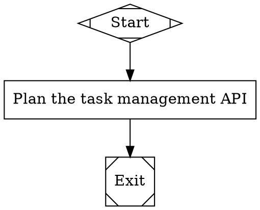
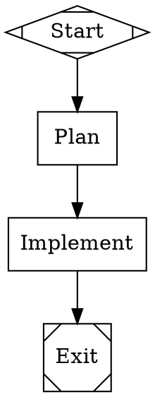
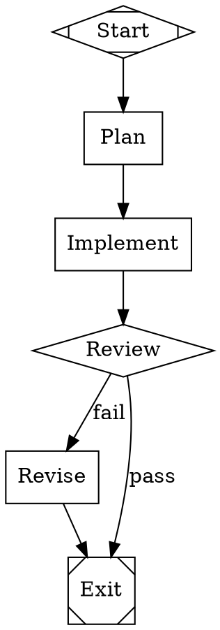
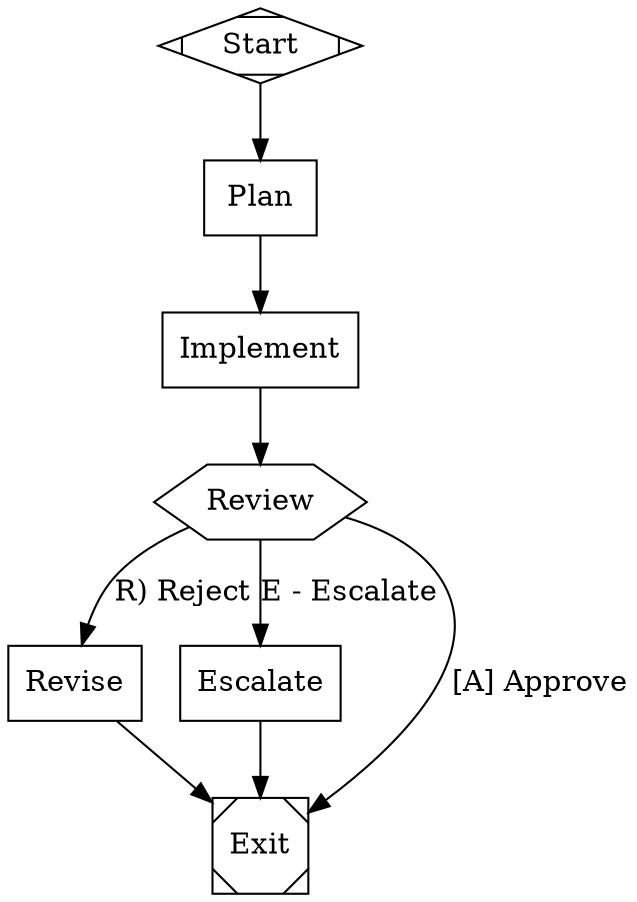
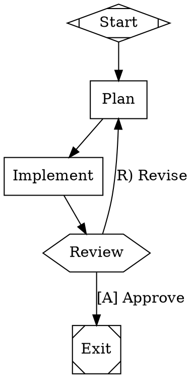
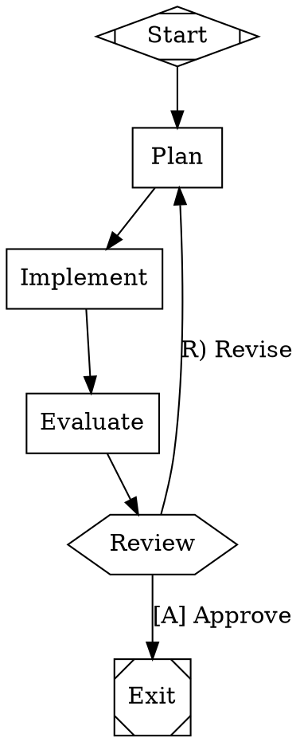
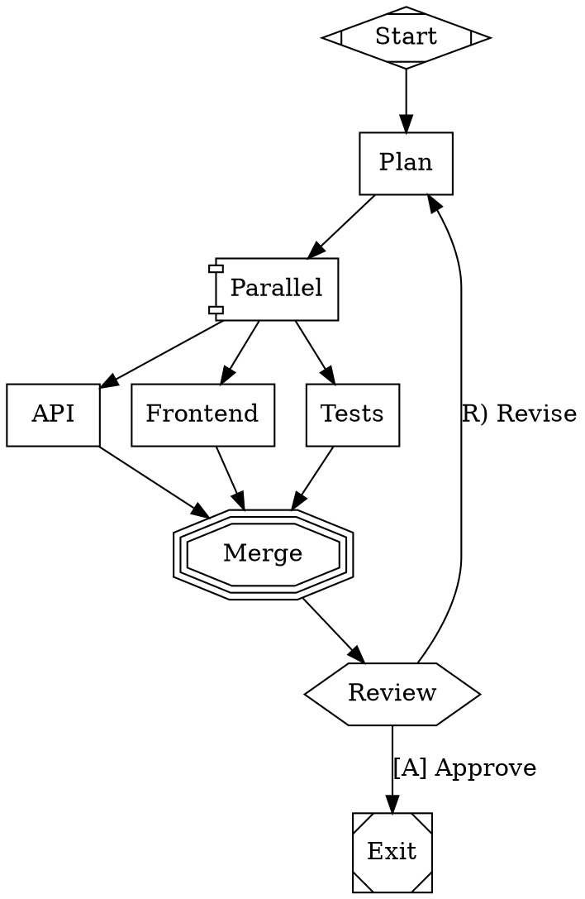
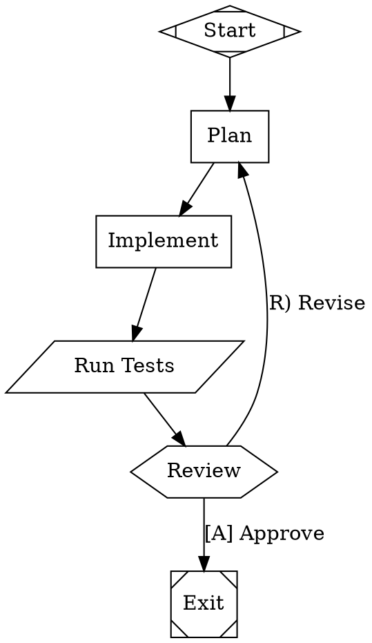

# Attractor Tutorial

Attractor is a pipeline engine that turns DOT graph files into executable workflows. You describe what to build as a directed graph -- nodes for tasks, edges for order -- and Attractor drives an LLM through each step. This tutorial teaches you Attractor by building one project from scratch: a task management API.

Each chapter introduces one concept. By the end, you will have a complete pipeline that plans, implements, tests, and iterates on a real codebase.

**What you need to follow along:** a terminal, Python 3.12 or later, and the `uv` package manager. No prior experience with DOT graphs or pipeline tools is required.

---

## Chapter 1: Installation & Setup

This chapter gets Attractor running on your machine and explains what each package does.

### Prerequisites

You need three things installed before you start:

- **Python 3.12+** -- Attractor uses modern Python features that require 3.12 or later. Check your version with `python3 --version`.
- **uv** -- A fast Python package manager. Install it with `curl -LsSf https://astral.sh/uv/install.sh | sh` or see [uv's documentation](https://docs.astral.sh/uv/getting-started/installation/).
- **Graphviz** (optional) -- If you want to render your pipeline graphs as SVG diagrams, install Graphviz. On macOS: `brew install graphviz`. On Ubuntu: `sudo apt install graphviz`. This is not required to run pipelines.

### Clone and sync

Clone the Attractor repository and install all dependencies:

```bash
git clone https://github.com/attractorproject/attractor.git
cd attractor
uv sync
```

`uv sync` reads the workspace configuration and installs all three packages in development mode. Verify the installation by running:

```bash
uv run attractor --help
```

You should see output listing the available commands: `run`, `validate`, `resume`, and `serve`.

### Render a graph (optional)

If you installed Graphviz, you can turn any `.dot` file into an SVG image:

```bash
dot -Tsvg file.dot -o file.svg
```

This is useful for visualizing your pipeline, but Attractor itself does not require Graphviz. Attractor parses DOT files directly with its own parser.

### What each package does

Attractor is split into three packages, each with a specific role:

| Package | Purpose |
|---|---|
| **attractor-llm** | Low-level LLM client. Sends prompts to language model APIs (Claude, OpenAI, etc.) and returns responses. Handles HTTP, retries, and response parsing. |
| **attractor-agent** | Agent layer built on top of attractor-llm. Manages multi-turn conversations, tool use, and structured output. |
| **attractor** | The pipeline engine itself. Parses DOT files, validates graphs, executes nodes in order, and writes logs. Depends on both packages above. Provides the `attractor` CLI. |

You interact with the `attractor` CLI. The other two packages work behind the scenes when the engine calls an LLM backend.

---

## Chapter 2: Your First Pipeline

This chapter builds a minimal pipeline, validates it, and runs it in dry-run mode.

### The DOT file

Create a file named `task-manager.dot` with the following contents:



This file lives at [`docs/examples/ch02-first-pipeline.dot`](examples/ch02-first-pipeline.dot) in the repository.

### DOT syntax explained

**`digraph task_manager`** declares a directed graph named `task_manager`. The `digraph` keyword tells the parser that edges have direction (A -> B means A runs before B, not the reverse). The graph name becomes the pipeline's identifier in logs and output.

**`goal`** is a graph-level attribute. It holds a one-sentence summary of what the pipeline builds. Nodes can reference this value in their prompts using `$goal`, so you define the project's purpose once and reuse it throughout.

**Node shapes** tell Attractor what kind of handler to use for each node:

| Shape | Meaning | Handler |
|---|---|---|
| `Mdiamond` | Pipeline entry point | start |
| `Msquare` | Pipeline exit point | exit |
| `box` | LLM task (default shape) | codergen |

A node with `shape=box` is handled by the **codergen** handler, which sends a prompt to the LLM backend and writes the response to disk. You will see this handler in detail in Chapter 3.

**`label`** sets the node's display name. For LLM task nodes (`box` shape), the label also serves as the default prompt -- the text sent to the LLM backend when no explicit `prompt` attribute is set.

**Edges** (`Start -> Plan`, `Plan -> Exit`) define execution order. The engine walks these edges one at a time, executing each node before moving to the next.

### Validate the pipeline

Run the validator to check your DOT file for structural errors:

```bash
uv run attractor validate task-manager.dot
```

Expected output:

```
Pipeline 'task_manager' is valid (3 nodes, 2 edges)
```

The validator checks that the graph has exactly one start node, at least one exit node, all edges reference existing nodes, and the graph is connected. If anything is wrong, it prints specific error messages with the rule that failed.

### Run in dry-run mode

Run the pipeline without calling any LLM backend:

```bash
uv run attractor run --dry-run task-manager.dot
```

Expected output:

```
Pipeline 'task_manager' completed: success
Notes: [dry-run] Plan
```

**What `--dry-run` does:** the engine walks the entire graph, visiting each node in order, but skips the LLM call. Every node returns an immediate success with the note `[dry-run] <node_id>`. This lets you verify that your graph structure, edge routing, and node ordering work before spending time and money on real LLM calls.

**What a real run does:** without `--dry-run`, the engine calls the configured LLM backend at each `box` node. The codergen handler sends the node's prompt (or label) to the LLM, writes the prompt and response to disk, and returns the outcome. A real run produces actual generated content -- plans, code, tests -- in the log directory.

---

## Chapter 3: Adding Real Work

This chapter expands the pipeline with a second LLM node, introduces the `prompt` attribute, and explains what the codergen handler writes to disk.

### Expand the pipeline

Create a new file named `task-manager-v2.dot`:



This file lives at [`docs/examples/ch03-adding-work.dot`](examples/ch03-adding-work.dot) in the repository.

### Label vs. prompt

In Chapter 2, the Plan node used its `label` as the prompt: `"Plan the task management API"`. That works for simple cases, but real pipelines need more specific instructions.

The **`label`** attribute sets the node's display name. It appears in logs, validation output, and rendered diagrams. Keep it short -- a word or two that identifies the step.

The **`prompt`** attribute sets the text sent to the LLM backend. When present, it overrides the label for LLM purposes. Use it to give the LLM detailed, specific instructions.

The **`$goal`** variable expands to the graph's `goal` attribute at runtime. This keeps your prompts DRY -- you define the project's purpose once in the graph header, and every node that references `$goal` gets the current value. If you change the goal, every prompt updates automatically.

### The codergen handler

Every `box`-shaped node is handled by the **codergen** handler. Here is what it does, step by step:

1. **Build the prompt.** The handler takes the node's `prompt` attribute (or `label` if no prompt is set) and expands any variables like `$goal`.
2. **Write `prompt.md`.** The expanded prompt is written to `<log-dir>/<node-id>/prompt.md` so you can inspect exactly what was sent to the LLM.
3. **Call the LLM backend.** The prompt is sent to the configured language model. The backend returns a response.
4. **Write `response.md`.** The LLM's response is written to `<log-dir>/<node-id>/response.md`.
5. **Write `status.json`.** A structured status file records whether the node succeeded or failed, any notes, and context updates for downstream nodes.

After execution, the log directory for each node contains three files:

```
<log-dir>/
  Plan/
    prompt.md       # What was sent to the LLM
    response.md     # What came back
    status.json     # Outcome metadata
  Implement/
    prompt.md
    response.md
    status.json
```

This audit trail lets you review every step of the pipeline after it finishes. You can read `prompt.md` to verify the LLM received the right instructions, check `response.md` to see what it produced, and inspect `status.json` for structured outcome data.

### Run the expanded pipeline

Validate first:

```bash
uv run attractor validate task-manager-v2.dot
```

```
Pipeline 'task_manager' is valid (4 nodes, 3 edges)
```

Then run in dry-run mode:

```bash
uv run attractor run --dry-run task-manager-v2.dot
```

```
Pipeline 'task_manager' completed: success
Notes: [dry-run] Implement
```

The notes show the last node that completed before Exit. In dry-run mode, the engine walks Start, Plan, Implement, Exit -- but only Plan and Implement are "real" work nodes. The output confirms the engine traversed the full graph in order.

### Pipeline events

During execution, the engine emits events that trace the pipeline's progress. In a dry run, the event sequence for this pipeline is:

1. **`pipeline.start`** -- The engine begins. Logs the pipeline name and goal.
2. **`node.start`** (Start) -- The Start node is visited.
3. **`node.complete`** (Start) -- The Start handler returns success immediately.
4. **`node.start`** (Plan) -- The Plan node begins.
5. **`node.complete`** (Plan) -- In dry-run: instant success. In a real run: after the LLM responds.
6. **`node.start`** (Implement) -- The Implement node begins.
7. **`node.complete`** (Implement) -- Same as above.
8. **`pipeline.finalize`** -- The engine has reached Exit and the pipeline is done.

These events are useful for monitoring, debugging, and building integrations. The HTTP server (covered in a later chapter) streams these events to clients in real time.

### The `--log-dir` flag

By default, pipeline logs are written to `.attractor-runs/<graph-name>/`. You can override this with `--log-dir`:

```bash
uv run attractor run --dry-run --log-dir ./my-logs task-manager-v2.dot
```

This writes all output to `./my-logs/` instead of the default location. Use this when you want to keep logs for different runs separate, or when you want to inspect the output in a specific directory.

In dry-run mode, the log directory contains only a `checkpoint.json` file (no `prompt.md` or `response.md`, since no LLM calls are made). In a real run, you will find the full set of files described above for each work node.

---

## Chapter 4: Branching and Decisions

This chapter adds conditional branching to the pipeline. Instead of a single path from start to finish, the engine chooses between edges based on the outcome of each node.

### Add a Review node

Until now, the pipeline has been a straight line: Start, Plan, Implement, Exit. Real workflows branch. After implementation, you want a review step that either passes the work through or sends it back for revision.

Create a new file named `task-manager-v3.dot`:



This file lives at [`docs/examples/ch04-branching.dot`](examples/ch04-branching.dot) in the repository.

### The diamond shape

The `diamond` shape tells Attractor to use the **conditional** handler. A conditional node evaluates its outgoing edges and picks the one whose condition matches the node's outcome. This is how you build if/else logic in a pipeline.

Here is the updated shape table:

| Shape | Meaning | Handler |
|---|---|---|
| `Mdiamond` | Pipeline entry point | start |
| `Msquare` | Pipeline exit point | exit |
| `box` | LLM task (default) | codergen |
| `diamond` | Conditional branch | conditional |

### Condition expressions

Each outgoing edge from a conditional node can carry a `condition` attribute. The condition is a simple expression of the form `key=value`.

```
Review -> Exit [condition="outcome=success"]
Review -> Revise [condition="outcome=fail"]
```

The key `outcome` is special. After the engine executes a node, it records whether the node succeeded or failed. The value is either `success` or `fail`. The condition `outcome=success` matches when the preceding node completed without errors.

You can also use `!=` for negation (`outcome!=success`) and `&&` to combine clauses (`outcome=success && context.coverage>80`). For most pipelines, simple `outcome=success` and `outcome=fail` conditions cover what you need.

### How the engine selects an edge

When the engine finishes a node, it must decide which outgoing edge to follow. The selection algorithm works in priority order:

1. **Condition match.** The engine evaluates every outgoing edge that has a `condition` attribute. If one or more conditions match, it picks the matching edge with the highest `weight` (ties broken alphabetically by target node ID).
2. **Unconditional fallback.** If no condition matches, the engine looks for edges without a `condition` attribute. Among those, it picks the one with the highest `weight` (ties broken alphabetically).
3. **Any edge.** If there are no unconditional edges either, the engine falls back to the highest-weight edge regardless of condition.

In plain language: the engine checks each edge's condition. If one matches, it follows that edge. If none match, it picks the unconditional edge with the highest weight.

### The weight attribute

When multiple edges have matching conditions (or multiple unconditional edges exist), the `weight` attribute breaks the tie. Higher weight wins.

```
Review -> Exit [condition="outcome=success" weight=10]
Review -> Revise [condition="outcome=success" weight=5]
```

In this example, both edges match on `outcome=success`, but the edge to Exit has weight 10 and the edge to Revise has weight 5. The engine follows the edge to Exit. If you omit `weight`, it defaults to 0.

### Run the branching pipeline

Validate:

```bash
uv run attractor validate task-manager-v3.dot
```

```
Pipeline 'task_manager' is valid (6 nodes, 6 edges)
```

Run in dry-run mode:

```bash
uv run attractor run --dry-run task-manager-v3.dot
```

```
Pipeline 'task_manager' completed: success
Notes: [dry-run] Review
```

In dry-run mode, every node succeeds. The Review node's outcome is `success`, so the engine follows the `outcome=success` edge to Exit. The Revise node is never visited. To test the failure path, you need a real LLM run where the review actually fails -- or you can use the human review gate introduced in the next chapter.

---

## Chapter 5: Human Review Gates

This chapter replaces the automatic conditional review with a human decision point. The pipeline pauses, presents choices, and waits for a person to decide what happens next.

### Replace diamond with hexagon

The `diamond` shape routes automatically based on outcome. The `hexagon` shape does something different: it pauses the pipeline and asks a human to choose. Change the Review node's shape from `diamond` to `hexagon`, and replace condition-based edges with labeled edges that become selectable options.

Create a new file named `task-manager-v4.dot`:



This file lives at [`docs/examples/ch05-human-review.dot`](examples/ch05-human-review.dot) in the repository.

### The hexagon shape

The `hexagon` shape tells Attractor to use the **wait.human** handler. This handler pauses the pipeline and presents the outgoing edge labels as a multiple-choice prompt. The pipeline resumes only after a person (or an automated interviewer) selects an option.

| Shape | Meaning | Handler |
|---|---|---|
| `Mdiamond` | Pipeline entry point | start |
| `Msquare` | Pipeline exit point | exit |
| `box` | LLM task (default) | codergen |
| `diamond` | Conditional branch | conditional |
| `hexagon` | Human review gate | wait.human |

### Edge labels become options

Every outgoing edge from a hexagon node becomes a selectable option. The edge's `label` attribute is the text the reviewer sees. In this example, the Review node has three outgoing edges, so the reviewer sees three choices:

- `[A] Approve` -- follow the edge to Exit
- `R) Reject` -- follow the edge to Revise
- `E - Escalate` -- follow the edge to Escalate

The reviewer types their choice, and the engine follows the selected edge.

### Accelerator keys

Accelerator keys let the reviewer type a single character instead of the full label. Attractor recognizes three patterns:

| Pattern | Example | Key |
|---|---|---|
| `[K] Label` | `[A] Approve` | A |
| `K) Label` | `R) Reject` | R |
| `K - Label` | `E - Escalate` | E |

If you do not use any of these patterns, the accelerator key defaults to the first character of the label. Use explicit accelerator keys when two labels start with the same letter.

### What the reviewer sees

When the pipeline reaches the Review node, it pauses and displays a prompt like this:

```
Review: Review

Choose an action:
  [A] Approve
  [R] Reject
  [E] Escalate

Your choice:
```

The reviewer types `A`, `R`, or `E` and presses Enter. The engine matches the input to the corresponding edge and resumes execution. If the reviewer types `A`, the pipeline follows the edge to Exit and completes. If they type `R`, it follows the edge to Revise, which runs the LLM to fix the code, and then continues to Exit.

### Interviewer types

The person or system that answers human review prompts is called an **interviewer**. Attractor provides four interviewer implementations:

| Interviewer | Purpose |
|---|---|
| **AutoApprove** | Always picks the first option. Use in CI/CD pipelines where you want the pipeline to run unattended. |
| **Queue** | Reads from a pre-filled list of answers. Use in automated tests where you need deterministic, repeatable behavior. |
| **Callback** | Delegates to a custom function you provide. Use when you want to integrate with external systems (Slack, email, webhooks). |
| **Recording** | Wraps another interviewer and records every question-answer pair. Use for audit trails and compliance. |

In interactive mode (the default), the CLI prompts the user directly in the terminal. The interviewer types listed above are used when you run pipelines programmatically or through the HTTP server.

### Run with a human gate

Validate:

```bash
uv run attractor validate task-manager-v4.dot
```

```
Pipeline 'task_manager' is valid (7 nodes, 8 edges)
```

In dry-run mode, the engine uses the AutoApprove interviewer by default. It always selects the first option:

```bash
uv run attractor run --dry-run task-manager-v4.dot
```

```
Pipeline 'task_manager' completed: success
Notes: [dry-run] Review
```

The AutoApprove interviewer selected `[A] Approve`, so the engine followed the edge to Exit. To test other paths, you can run without `--dry-run` and answer the prompt interactively, or use the Queue interviewer programmatically.

---

## Chapter 6: Iteration Loops

This chapter adds a loop to the pipeline. When the reviewer rejects the work, the pipeline goes back to an earlier step and tries again. This is one of Attractor's most powerful features: the pipeline keeps iterating until the human approves.

### The revise loop

Instead of routing rejected work to a separate Revise node that then exits, you can send it back to Plan. The pipeline re-plans, re-implements, and presents the work for review again. This creates a cycle in the graph.

Create a new file named `task-manager-v5.dot`:



This file lives at [`docs/examples/ch06-loops.dot`](examples/ch06-loops.dot) in the repository.

### Why loops are powerful

Without loops, a failed review means the pipeline exits with partial results. You would have to fix the issues manually and re-run the whole pipeline from scratch. With a loop, the pipeline handles iteration for you. The reviewer rejects, the LLM re-plans and re-implements, and the reviewer checks again. This cycle continues until the reviewer approves or the retry limit is reached.

This matches how real teams work: plan, build, review, revise, repeat.

### Preventing infinite loops with max_retries

A loop without a limit can run forever. The `max_retries` attribute on a node sets the maximum number of times that node can execute in a single pipeline run.

```
Plan [shape=box label="Plan" max_retries=3]
```

With `max_retries=3`, the Plan node can execute up to 3 times. If the reviewer rejects a third time and the loop would send execution back to Plan, the engine stops the pipeline and reports a failure. Without `max_retries`, the graph-level default applies (50 retries).

Set `max_retries` on the node where the loop re-enters the graph. In this pipeline, that is Plan, because the revise edge points back to Plan.

### The retry_target attribute

The `retry_target` attribute tells the engine where to jump back to when a node fails. Instead of following the normal edges, the engine sends execution directly to the named node.

```
Implement [shape=box label="Implement" retry_target="Plan"]
```

With `retry_target="Plan"`, if the Implement node fails (the LLM produces invalid code, for example), the engine jumps back to Plan without waiting for the Review step. This is different from the review loop: `retry_target` handles automatic failure recovery, while the review loop handles human-directed revision.

The key difference: `retry_target` keeps all completed work in context. When the engine jumps back to Plan, the LLM sees what happened in the previous attempt and can adjust. Previous log files and context values remain available.

### The loop_restart attribute

For cases where you want a clean slate, edges can carry the `loop_restart` attribute:

```
Review -> Plan [label="R) Restart" loop_restart=true]
```

When the engine follows a `loop_restart` edge, it clears all pipeline state -- context values, node outcomes, accumulated logs -- and restarts from the target node as if the pipeline had just begun. This is useful when previous attempts produced so much noise that starting fresh gives better results.

The difference between the two approaches:

| Attribute | Keeps previous work | When to use |
|---|---|---|
| `retry_target` | Yes -- previous context, logs, and outcomes remain | Incremental fixes. The LLM learns from past attempts. |
| `loop_restart` | No -- clears all state and starts fresh | Complete do-overs. Previous attempts caused more confusion than help. |

Most pipelines use `retry_target` for automatic retries and normal loop-back edges for human-directed revision. Reserve `loop_restart` for situations where accumulated state actively hinders progress.

### Run the loop pipeline

Validate:

```bash
uv run attractor validate task-manager-v5.dot
```

```
Pipeline 'task_manager' is valid (5 nodes, 5 edges)
```

Run in dry-run mode:

```bash
uv run attractor run --dry-run task-manager-v5.dot
```

```
Pipeline 'task_manager' completed: success
Notes: [dry-run] Review
```

As before, dry-run mode uses the AutoApprove interviewer, which selects the first option (`[A] Approve`). The loop is never triggered. To exercise the loop, run without `--dry-run` and choose `R) Revise` at the review prompt. The pipeline will loop back to Plan, re-execute Plan and Implement, and present the Review prompt again -- up to 3 times before it gives up.

Note: the validator accepts this graph despite the back-edge from Review to Plan. Attractor explicitly supports cycles in the graph. The `max_retries` attribute is the safety mechanism that prevents infinite execution.

---

## Chapter 7: Quality Gates and Evaluation

The loop from Chapter 6 catches problems when a human reviewer rejects work. But what about problems the engine can detect on its own? Quality gates let you mark nodes whose success is required before the pipeline can exit. If a gate fails, the engine retries automatically -- no human intervention needed.

### Mark a node as a goal gate

Add `goal_gate=true` to the Implement node:

```
Implement [
    shape=box
    label="Implement"
    prompt="Implement the plan from the previous step for: $goal."
    goal_gate=true
    retry_target="Plan"
]
```

Two attributes work together here:

- **`goal_gate=true`** tells the engine that this node must succeed for the pipeline to pass.
- **`retry_target="Plan"`** tells the engine where to jump if the gate fails.

### When gates are checked

The engine does not check goal gates when a gate node runs. It checks them at the exit node, after the pipeline has attempted the full workflow. This matters: the pipeline runs Plan, Implement, Evaluate, and Review in sequence. Only when execution reaches the Exit node does the engine look back and ask, "Did every goal gate succeed?"

If any goal gate recorded a failure, the engine jumps to that gate's `retry_target` instead of exiting. Execution resumes from the retry target, preserving all context from previous attempts.

### The retry target chain

The engine resolves retry targets in priority order:

1. The failed gate node's own `retry_target` attribute.
2. The failed gate node's `fallback_retry_target` attribute.
3. The graph-level `retry_target` attribute.
4. The graph-level `fallback_retry_target` attribute.

If none of these exist, the pipeline fails with an error. Always set a `retry_target` on goal gate nodes to avoid this.

### LLM-as-judge: a separate evaluation node

A goal gate on Implement checks whether the LLM reported success. But LLMs are optimistic -- they often report success even when the output has problems. A stronger pattern uses a separate evaluation node with a different (often stronger) model to judge the output.

Add an Evaluate node between Implement and Review:

```
Evaluate [
    shape=box
    label="Evaluate"
    prompt="Review the implementation for correctness, completeness, and code quality. Return success if the code meets the plan requirements, or fail with specific feedback."
    llm_model="claude-sonnet-4-20250514"
    goal_gate=true
    retry_target="Plan"
]
```

The `llm_model` attribute overrides the default model for this node. Use a strong model for evaluation -- the evaluator reads the output, not the codebase, so it processes less context and runs fast even with a capable model.

This creates two goal gates: Implement must succeed (the code was generated) and Evaluate must succeed (the code passed review). If either fails, the engine loops back to Plan.

### Multi-stage validation

For production pipelines, chain multiple validation steps. Each step is a separate node:

```
Implement -> Lint -> Test -> Evaluate -> Review
```

- **Lint** runs a linter (a tool node -- covered in Chapter 9).
- **Test** runs the test suite (another tool node).
- **Evaluate** is the LLM-as-judge node described above.
- **Review** is the human gate from Chapter 5.

Mark each validation node with `goal_gate=true` and `retry_target="Plan"`. If linting fails, the pipeline loops back and tries again. If tests fail, same result. Each gate checks one concern.

### Accepting partial success with allow_partial

Sometimes retries are exhausted but the output is still useful. The `allow_partial` attribute accepts partial success when a node's retries run out:

```
Implement [
    shape=box
    label="Implement"
    goal_gate=true
    retry_target="Plan"
    allow_partial=true
]
```

Without `allow_partial`, a node that exhausts its retries reports a hard failure. With `allow_partial=true`, the engine records `partial_success` instead. A partial success satisfies a goal gate -- the pipeline can still exit normally.

Use `allow_partial` when some output is better than no output. For example, an implementation that covers 4 of 5 endpoints is more useful than a failure that produces nothing.

### The complete quality gates pipeline

Create a file named `task-manager-v6.dot`:



This file lives at [`docs/examples/ch07-quality-gates.dot`](examples/ch07-quality-gates.dot) in the repository.

The flow: Start leads to Plan, Plan leads to Implement, Implement leads to Evaluate, Evaluate leads to Review. The reviewer can approve (exit) or revise (loop back). If execution reaches Exit but either Implement or Evaluate recorded a failure, the engine jumps back to Plan and tries again.

### Run the quality gates pipeline

Validate:

```bash
uv run attractor validate task-manager-v6.dot
```

```
Pipeline 'task_manager' is valid (6 nodes, 6 edges)
```

Run in dry-run mode:

```bash
uv run attractor run --dry-run task-manager-v6.dot
```

```
Pipeline 'task_manager' completed: success
Notes: [dry-run] Evaluate
```

In dry-run mode, every node succeeds, so both goal gates pass. The engine exits normally. To exercise the retry loop, run without `--dry-run` and observe what happens when the evaluator returns a failure: the engine jumps back to Plan instead of proceeding to the human review.

---

## Chapter 8: Parallel Work

So far, every pipeline executes one node at a time. This chapter splits work into parallel branches that run concurrently and merge back together.

### The fan-out / fan-in pattern

Parallel execution uses two special node shapes:

| Shape | Handler | Purpose |
|---|---|---|
| `component` | ParallelHandler | Fan-out: launches branches concurrently |
| `tripleoctagon` | FanInHandler | Fan-in: collects results and picks the best |

The pattern looks like this: a single node fans out to multiple branches, each branch does its work independently, and a merge node collects all results.

### Split implementation into parallel branches

Replace the single Implement node with three parallel branches -- API, Frontend, and Tests:

```dot
Parallel [
    shape=component
    label="Parallel"
    join_policy="wait_all"
    error_policy="continue"
]

API [
    shape=box
    label="API"
    prompt="Implement the FastAPI endpoints and data models from the plan."
]

Frontend [
    shape=box
    label="Frontend"
    prompt="Implement the frontend components from the plan."
]

Tests [
    shape=box
    label="Tests"
    prompt="Write pytest test cases covering the API endpoints from the plan."
]

Merge [
    shape=tripleoctagon
    label="Merge"
]
```

Connect them:

```
Plan -> Parallel

Parallel -> API
Parallel -> Frontend
Parallel -> Tests

API -> Merge
Frontend -> Merge
Tests -> Merge

Merge -> Review
```

The Parallel node (shape `component`) triggers the ParallelHandler. The engine launches API, Frontend, and Tests concurrently. When all three finish, execution continues to the Merge node (shape `tripleoctagon`), which consolidates results.

### Context isolation

Each parallel branch receives a clone of the pipeline context at the moment the Parallel node executes. Changes made in one branch do not affect other branches. If the API branch sets `context.api_ready = true`, the Frontend and Tests branches never see that value.

After all branches complete, the engine stores a JSON summary of branch results in `parallel.results`. The Merge node reads this summary, ranks the results, and records the best branch in `parallel.fan_in.best_id` and `parallel.fan_in.best_outcome`.

### Join policies

The `join_policy` attribute on the fan-out node controls when the parallel group reports success. Set it in the node's extra attributes:

| Policy | Behavior |
|---|---|
| `wait_all` (default) | Succeed only if every branch succeeds. If any branch fails, report partial success. |
| `first_success` | Succeed as soon as one branch succeeds. Other branches may still be running. |
| `k_of_n` | Succeed when at least *k* branches succeed. Set `k` as a separate attribute (e.g., `k=2`). |

Examples:

```
// All branches must pass
Parallel [shape=component join_policy="wait_all"]

// Any one branch passing is enough
Parallel [shape=component join_policy="first_success"]

// At least 2 of 3 branches must pass
Parallel [shape=component join_policy="k_of_n" k=2]
```

### Error policies

The `error_policy` attribute controls what happens when a branch fails:

| Policy | Behavior |
|---|---|
| `continue` (default) | Keep running other branches. Report the failure in the results. |
| `fail_fast` | Cancel all remaining branches as soon as one fails. |
| `ignore` | Treat failures as if they did not happen. |

Use `fail_fast` when branches share a resource and one failure invalidates the others. Use `continue` (the default) when branches are independent and you want as many results as possible.

### The complete parallel pipeline

Create a file named `task-manager-v7.dot`:



This file lives at [`docs/examples/ch08-parallel.dot`](examples/ch08-parallel.dot) in the repository.

The topology: Start leads to Plan, Plan leads to Parallel. Parallel fans out to API, Frontend, and Tests. All three converge on Merge. Merge leads to Review, which can approve (exit) or revise (loop back to Plan).

### Run the parallel pipeline

Validate:

```bash
uv run attractor validate task-manager-v7.dot
```

```
Pipeline 'task_manager' is valid (9 nodes, 11 edges)
```

Run in dry-run mode:

```bash
uv run attractor run --dry-run task-manager-v7.dot
```

```
Pipeline 'task_manager' completed: success
Notes: [dry-run] Merge
```

In dry-run mode, all three branches succeed immediately. The Merge node consolidates results and the pipeline exits through Review. In a real run, the three LLM calls execute concurrently -- the total time is the duration of the slowest branch, not the sum of all three.

---

## Chapter 9: Tool Nodes

LLM nodes generate code, but they cannot run it. Tool nodes bridge that gap. A tool node executes a shell command -- a test suite, a linter, a build script -- and feeds the output back into the pipeline context.

### Add a test runner

Add a node with the `parallelogram` shape after Implement:

```dot
RunTests [
    shape=parallelogram
    label="Run Tests"
    tool_command="cd workspace && uv run pytest tests/ -v --tb=short"
    timeout="60s"
]
```

Three attributes matter:

- **`shape=parallelogram`** tells the engine to use the ToolHandler instead of the default LLM handler.
- **`tool_command`** is the shell command to execute. The engine runs it with `asyncio.create_subprocess_shell`, so standard shell features (pipes, `&&`, `cd`) work.
- **`timeout`** sets the maximum execution time. Accepts `s` (seconds) or `m` (minutes). If the command runs longer, the engine kills it and records a failure. The default is 30 seconds.

### How tool output flows into context

When a tool node finishes, the engine stores the command's stdout in the context key `tool.output`. Subsequent nodes can reference this value. If a tool node fails (non-zero exit code), the engine still captures the output -- test failures, compiler errors, linter warnings -- so downstream nodes can use the error details.

The engine also writes the full output (stdout and stderr) to `<logs_root>/<node_id>/tool_output.txt` for inspection after the run.

### Tool node outcomes

The ToolHandler maps exit codes to outcomes:

| Exit code | Outcome | Meaning |
|---|---|---|
| 0 | success | Command completed without errors. |
| Non-zero | fail | Command reported errors. The failure reason includes the exit code. |
| (timeout) | fail | Command exceeded the timeout. The failure reason says "timed out." |

A failed tool node behaves like any other failed node. If it has `goal_gate=true`, the engine checks it at exit time. If it has `retry_target`, the engine can loop back on failure.

### Combining tools with goal gates

Tool nodes pair well with goal gates. Mark the RunTests node as a goal gate so the pipeline cannot exit until tests pass:

```
RunTests [
    shape=parallelogram
    label="Run Tests"
    tool_command="cd workspace && uv run pytest tests/ -v --tb=short"
    timeout="60s"
    goal_gate=true
    retry_target="Implement"
]
```

Now if tests fail, the engine loops back to Implement. The LLM sees the test output in context (via `tool.output`) and can fix the code accordingly.

### The complete tool node pipeline

Create a file named `task-manager-v8.dot`:



This file lives at [`docs/examples/ch09-tool-nodes.dot`](examples/ch09-tool-nodes.dot) in the repository.

The flow: Start leads to Plan, Plan leads to Implement, Implement leads to RunTests. The test runner executes `pytest`, captures the output, and records success or failure. Then Review presents the results to a human. The reviewer can approve or send the pipeline back to Plan.

### Run the tool node pipeline

Validate:

```bash
uv run attractor validate task-manager-v8.dot
```

```
Pipeline 'task_manager' is valid (6 nodes, 6 edges)
```

Run in dry-run mode:

```bash
uv run attractor run --dry-run task-manager-v8.dot
```

```
Pipeline 'task_manager' completed: success
Notes: [dry-run] RunTests
```

In dry-run mode, the tool node is simulated -- no shell command executes. To see the tool in action, run without `--dry-run` in a project directory that has a `tests/` folder and `pytest` installed. The engine will execute the command, capture the output, and store it in context for the Review step.

Note: tool nodes require that the command exists on the host machine. If `pytest` is not installed or the `workspace` directory does not exist, the tool node fails with an appropriate error message.
