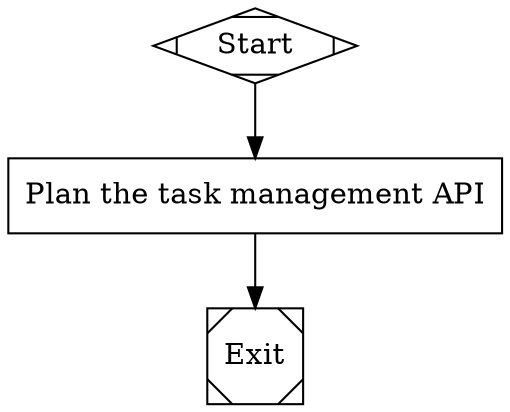
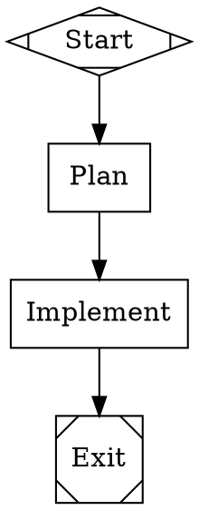

# Attractor Tutorial

Attractor is a pipeline engine that turns DOT graph files into executable workflows. You describe what to build as a directed graph -- nodes for tasks, edges for order -- and Attractor drives an LLM through each step. This tutorial teaches you Attractor by building one project from scratch: a task management API.

Each chapter introduces one concept. By the end, you will have a complete pipeline that plans, implements, tests, and iterates on a real codebase.

**What you need to follow along:** a terminal, Python 3.12 or later, and the `uv` package manager. No prior experience with DOT graphs or pipeline tools is required.

---

## Chapter 1: Installation & Setup

This chapter gets Attractor running on your machine and explains what each package does.

### Prerequisites

You need three things installed before you start:

- **Python 3.12+** -- Attractor uses modern Python features that require 3.12 or later. Check your version with `python3 --version`.
- **uv** -- A fast Python package manager. Install it with `curl -LsSf https://astral.sh/uv/install.sh | sh` or see [uv's documentation](https://docs.astral.sh/uv/getting-started/installation/).
- **Graphviz** (optional) -- If you want to render your pipeline graphs as SVG diagrams, install Graphviz. On macOS: `brew install graphviz`. On Ubuntu: `sudo apt install graphviz`. This is not required to run pipelines.

### Clone and sync

Clone the Attractor repository and install all dependencies:

```bash
git clone https://github.com/attractorproject/attractor.git
cd attractor
uv sync
```

`uv sync` reads the workspace configuration and installs all three packages in development mode. Verify the installation by running:

```bash
uv run attractor --help
```

You should see output listing the available commands: `run`, `validate`, `resume`, and `serve`.

### Render a graph (optional)

If you installed Graphviz, you can turn any `.dot` file into an SVG image:

```bash
dot -Tsvg file.dot -o file.svg
```

This is useful for visualizing your pipeline, but Attractor itself does not require Graphviz. Attractor parses DOT files directly with its own parser.

### What each package does

Attractor is split into three packages, each with a specific role:

| Package | Purpose |
|---|---|
| **attractor-llm** | Low-level LLM client. Sends prompts to language model APIs (Claude, OpenAI, etc.) and returns responses. Handles HTTP, retries, and response parsing. |
| **attractor-agent** | Agent layer built on top of attractor-llm. Manages multi-turn conversations, tool use, and structured output. |
| **attractor** | The pipeline engine itself. Parses DOT files, validates graphs, executes nodes in order, and writes logs. Depends on both packages above. Provides the `attractor` CLI. |

You interact with the `attractor` CLI. The other two packages work behind the scenes when the engine calls an LLM backend.

---

## Chapter 2: Your First Pipeline

This chapter builds a minimal pipeline, validates it, and runs it in dry-run mode.

### The DOT file

Create a file named `task-manager.dot` with the following contents:



This file lives at [`docs/examples/ch02-first-pipeline.dot`](examples/ch02-first-pipeline.dot) in the repository.

### DOT syntax explained

**`digraph task_manager`** declares a directed graph named `task_manager`. The `digraph` keyword tells the parser that edges have direction (A -> B means A runs before B, not the reverse). The graph name becomes the pipeline's identifier in logs and output.

**`goal`** is a graph-level attribute. It holds a one-sentence summary of what the pipeline builds. Nodes can reference this value in their prompts using `$goal`, so you define the project's purpose once and reuse it throughout.

**Node shapes** tell Attractor what kind of handler to use for each node:

| Shape | Meaning | Handler |
|---|---|---|
| `Mdiamond` | Pipeline entry point | start |
| `Msquare` | Pipeline exit point | exit |
| `box` | LLM task (default shape) | codergen |

A node with `shape=box` is handled by the **codergen** handler, which sends a prompt to the LLM backend and writes the response to disk. You will see this handler in detail in Chapter 3.

**`label`** sets the node's display name. For LLM task nodes (`box` shape), the label also serves as the default prompt -- the text sent to the LLM backend when no explicit `prompt` attribute is set.

**Edges** (`Start -> Plan`, `Plan -> Exit`) define execution order. The engine walks these edges one at a time, executing each node before moving to the next.

### Validate the pipeline

Run the validator to check your DOT file for structural errors:

```bash
uv run attractor validate task-manager.dot
```

Expected output:

```
Pipeline 'task_manager' is valid (3 nodes, 2 edges)
```

The validator checks that the graph has exactly one start node, at least one exit node, all edges reference existing nodes, and the graph is connected. If anything is wrong, it prints specific error messages with the rule that failed.

### Run in dry-run mode

Run the pipeline without calling any LLM backend:

```bash
uv run attractor run --dry-run task-manager.dot
```

Expected output:

```
Pipeline 'task_manager' completed: success
Notes: [dry-run] Plan
```

**What `--dry-run` does:** the engine walks the entire graph, visiting each node in order, but skips the LLM call. Every node returns an immediate success with the note `[dry-run] <node_id>`. This lets you verify that your graph structure, edge routing, and node ordering work before spending time and money on real LLM calls.

**What a real run does:** without `--dry-run`, the engine calls the configured LLM backend at each `box` node. The codergen handler sends the node's prompt (or label) to the LLM, writes the prompt and response to disk, and returns the outcome. A real run produces actual generated content -- plans, code, tests -- in the log directory.

---

## Chapter 3: Adding Real Work

This chapter expands the pipeline with a second LLM node, introduces the `prompt` attribute, and explains what the codergen handler writes to disk.

### Expand the pipeline

Create a new file named `task-manager-v2.dot`:



This file lives at [`docs/examples/ch03-adding-work.dot`](examples/ch03-adding-work.dot) in the repository.

### Label vs. prompt

In Chapter 2, the Plan node used its `label` as the prompt: `"Plan the task management API"`. That works for simple cases, but real pipelines need more specific instructions.

The **`label`** attribute sets the node's display name. It appears in logs, validation output, and rendered diagrams. Keep it short -- a word or two that identifies the step.

The **`prompt`** attribute sets the text sent to the LLM backend. When present, it overrides the label for LLM purposes. Use it to give the LLM detailed, specific instructions.

The **`$goal`** variable expands to the graph's `goal` attribute at runtime. This keeps your prompts DRY -- you define the project's purpose once in the graph header, and every node that references `$goal` gets the current value. If you change the goal, every prompt updates automatically.

### The codergen handler

Every `box`-shaped node is handled by the **codergen** handler. Here is what it does, step by step:

1. **Build the prompt.** The handler takes the node's `prompt` attribute (or `label` if no prompt is set) and expands any variables like `$goal`.
2. **Write `prompt.md`.** The expanded prompt is written to `<log-dir>/<node-id>/prompt.md` so you can inspect exactly what was sent to the LLM.
3. **Call the LLM backend.** The prompt is sent to the configured language model. The backend returns a response.
4. **Write `response.md`.** The LLM's response is written to `<log-dir>/<node-id>/response.md`.
5. **Write `status.json`.** A structured status file records whether the node succeeded or failed, any notes, and context updates for downstream nodes.

After execution, the log directory for each node contains three files:

```
<log-dir>/
  Plan/
    prompt.md       # What was sent to the LLM
    response.md     # What came back
    status.json     # Outcome metadata
  Implement/
    prompt.md
    response.md
    status.json
```

This audit trail lets you review every step of the pipeline after it finishes. You can read `prompt.md` to verify the LLM received the right instructions, check `response.md` to see what it produced, and inspect `status.json` for structured outcome data.

### Run the expanded pipeline

Validate first:

```bash
uv run attractor validate task-manager-v2.dot
```

```
Pipeline 'task_manager' is valid (4 nodes, 3 edges)
```

Then run in dry-run mode:

```bash
uv run attractor run --dry-run task-manager-v2.dot
```

```
Pipeline 'task_manager' completed: success
Notes: [dry-run] Implement
```

The notes show the last node that completed before Exit. In dry-run mode, the engine walks Start, Plan, Implement, Exit -- but only Plan and Implement are "real" work nodes. The output confirms the engine traversed the full graph in order.

### Pipeline events

During execution, the engine emits events that trace the pipeline's progress. In a dry run, the event sequence for this pipeline is:

1. **`pipeline.start`** -- The engine begins. Logs the pipeline name and goal.
2. **`node.start`** (Start) -- The Start node is visited.
3. **`node.complete`** (Start) -- The Start handler returns success immediately.
4. **`node.start`** (Plan) -- The Plan node begins.
5. **`node.complete`** (Plan) -- In dry-run: instant success. In a real run: after the LLM responds.
6. **`node.start`** (Implement) -- The Implement node begins.
7. **`node.complete`** (Implement) -- Same as above.
8. **`pipeline.finalize`** -- The engine has reached Exit and the pipeline is done.

These events are useful for monitoring, debugging, and building integrations. The HTTP server (covered in a later chapter) streams these events to clients in real time.

### The `--log-dir` flag

By default, pipeline logs are written to `.attractor-runs/<graph-name>/`. You can override this with `--log-dir`:

```bash
uv run attractor run --dry-run --log-dir ./my-logs task-manager-v2.dot
```

This writes all output to `./my-logs/` instead of the default location. Use this when you want to keep logs for different runs separate, or when you want to inspect the output in a specific directory.

In dry-run mode, the log directory contains only a `checkpoint.json` file (no `prompt.md` or `response.md`, since no LLM calls are made). In a real run, you will find the full set of files described above for each work node.
