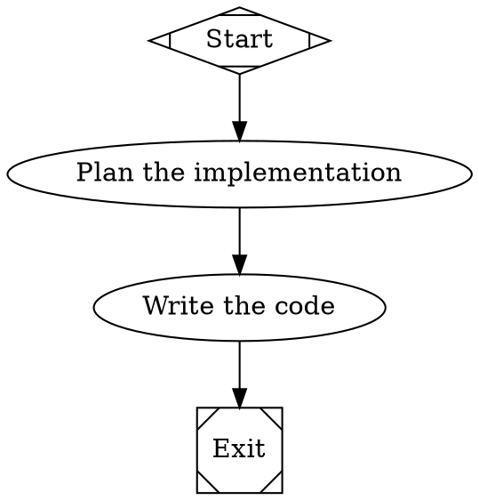

# Attractor User Guide

Attractor executes software pipelines defined as DOT digraphs. Each node in the graph represents a stage — an LLM call, a human review, a shell command, or a parallel fan-out — and edges define the flow between them.

Three packages compose the system:

- **attractor-llm** — unified LLM client (OpenAI, Anthropic, Gemini)
- **attractor-agent** — coding agent loop with tool execution
- **attractor** — DOT parser, graph engine, CLI, and HTTP server

## Installation

Requires Python 3.12+ and [uv](https://docs.astral.sh/uv/).

```bash
git clone https://github.com/gutelius/attractor.git
cd attractor
uv sync --all-packages --all-extras
```

Verify the installation:

```bash
uv run attractor --help
```

## Quick Start

### 1. Write a Pipeline

Create `my-pipeline.dot`:



### 2. Validate It

```bash
uv run attractor validate my-pipeline.dot
```

### 3. Run It

```bash
uv run attractor run my-pipeline.dot --dry-run
```

Remove `--dry-run` to execute with a real LLM backend.

## CLI Reference

### `attractor run <dotfile>`

Execute a pipeline.

| Flag | Description |
|------|-------------|
| `--goal TEXT` | Override the pipeline's goal |
| `--model TEXT` | Default LLM model |
| `--log-dir PATH` | Directory for logs and checkpoints |
| `--dry-run` | Simulate execution without calling LLM backends |
| `--max-steps INT` | Maximum execution steps (default: 1000) |

### `attractor validate <dotfile>`

Check a DOT file for errors without executing. Reports errors, warnings, and node/edge counts.

### `attractor resume <checkpoint> <dotfile>`

Resume a pipeline from a saved checkpoint file.

| Flag | Description |
|------|-------------|
| `--log-dir PATH` | Directory for logs |

### `attractor serve`

Start the HTTP server.

| Flag | Description |
|------|-------------|
| `--host TEXT` | Bind address (default: 0.0.0.0) |
| `--port INT` | Bind port (default: 8000) |

## Writing Pipelines

### Node Shapes

Each shape maps to a handler that controls how the node executes:

| Shape | Handler | Purpose |
|-------|---------|---------|
| `Mdiamond` | start | Entry point (exactly one required) |
| `Msquare` | exit | Terminal node (exactly one required) |
| `box` | codergen | LLM-powered code generation (default) |
| `hexagon` | wait.human | Pause for human input |
| `diamond` | conditional | Decision point (routing only) |
| `component` | parallel | Fan-out to parallel branches |
| `tripleoctagon` | parallel.fan_in | Collect parallel results |
| `parallelogram` | tool | Execute a shell command |
| `house` | stack.manager_loop | Manage a child pipeline |

### Node Attributes

```dot
TaskNode [
    label = "Implement feature",
    shape = box,
    prompt = "Write the implementation for $goal",
    max_retries = 3,
    goal_gate = true,
    retry_target = "Plan",
    fidelity = "full",
    llm_model = "claude-sonnet-4-5",
    timeout = "5m"
]
```

| Attribute | Type | Description |
|-----------|------|-------------|
| `label` | string | Display name |
| `shape` | string | Determines handler type |
| `prompt` | string | LLM prompt template (`$goal` expands to pipeline goal) |
| `max_retries` | int | Retry count on failure |
| `goal_gate` | bool | Must succeed before pipeline can exit |
| `retry_target` | string | Node to jump back to on goal gate failure |
| `fidelity` | string | Context carryover mode: full, truncate, compact, summary |
| `llm_model` | string | LLM model for this node |
| `llm_provider` | string | LLM provider for this node |
| `timeout` | string | Execution timeout (e.g., "5m", "30s") |
| `allow_partial` | bool | Accept partial success after retries exhausted |

### Edge Attributes

```dot
Review -> Implement [label="approve", condition="outcome=success"]
Review -> Revise [label="revise", condition="outcome=fail"]
```

| Attribute | Type | Description |
|-----------|------|-------------|
| `label` | string | Edge label (used for preferred_label matching) |
| `condition` | string | Condition expression for routing |
| `weight` | int | Priority weight (higher wins ties) |
| `loop_restart` | bool | Reset pipeline state and restart from target |
| `fidelity` | string | Override context fidelity for this transition |

### Condition Expressions

Conditions control which edge the engine follows after a node completes.

```
outcome=success              # status equals "success"
outcome!=fail                # status does not equal "fail"
outcome=success&&context.ready=true   # AND clause
context.approval             # bare key truthiness
```

The engine resolves `outcome` from the node's result status. Keys prefixed with `context.` read from the pipeline context store.

### Graph-Level Attributes

```dot
digraph MyPipeline {
    goal = "Build a REST API"
    default_max_retry = 2
    retry_target = "Plan"

    model_stylesheet = "
        * { llm_model: claude-sonnet-4-5; }
        .critical { llm_model: claude-opus-4-6; reasoning_effort: high; }
        #FinalReview { llm_model: claude-opus-4-6; }
    "
    // ... nodes and edges
}
```

### Model Stylesheet

The `model_stylesheet` attribute uses CSS-like syntax to assign LLM settings to nodes. Three selector types, ordered by specificity:

| Selector | Specificity | Matches |
|----------|-------------|---------|
| `*` | 0 | All nodes |
| `.classname` | 1 | Nodes in a subgraph named `classname` |
| `#NodeId` | 2 | A single node by ID |

Higher specificity wins. Equal specificity: later rules win. Explicit node attributes always override the stylesheet.

## Programmatic API

### Run a Pipeline

```python
import asyncio
from attractor import PipelineEngine, EngineConfig

async def main():
    config = EngineConfig(logs_root="./logs", dry_run=True)
    engine = PipelineEngine(config)

    outcome = await engine.run_dot("""
        digraph G {
            Start [shape=Mdiamond]
            Task [label="Do work"]
            Exit [shape=Msquare]
            Start -> Task -> Exit
        }
    """)

    print(f"Status: {outcome.status.value}")
    for event in engine.events:
        print(f"  {event.kind}: {event.node_id}")

asyncio.run(main())
```

### Parse and Validate Separately

```python
from attractor import parse_dot, validate, validate_or_raise
from attractor.transforms import VariableExpansionTransform, StylesheetTransform

graph = parse_dot(open("pipeline.dot").read())
graph = VariableExpansionTransform().apply(graph)
graph = StylesheetTransform().apply(graph)

# Get diagnostics
diagnostics = validate(graph)
for d in diagnostics:
    print(f"{d.severity.value}: [{d.rule}] {d.message}")

# Or raise on errors
validate_or_raise(graph)
```

### Custom Backend

Supply a backend to handle LLM calls for codergen nodes:

```python
from attractor import PipelineEngine, EngineConfig, Outcome, StageStatus

class MyBackend:
    async def run(self, node, prompt, context):
        # Call your LLM here
        result = await call_llm(prompt)
        return Outcome(
            status=StageStatus.SUCCESS,
            context_updates={"last_output": result},
        )

config = EngineConfig(codergen_backend=MyBackend())
engine = PipelineEngine(config)
```

### Human-in-the-Loop

Use an interviewer to handle human review nodes (`hexagon` shape):

```python
from attractor import (
    PipelineEngine, EngineConfig,
    QueueInterviewer, Answer, AnswerValue,
)

# Pre-fill answers for automated testing
interviewer = QueueInterviewer([
    Answer(value="A"),           # approve first option
    Answer(value=AnswerValue.SKIPPED),  # skip second question
])

config = EngineConfig(interviewer=interviewer)
engine = PipelineEngine(config)
```

Four interviewer implementations:

| Class | Behavior |
|-------|----------|
| `AutoApproveInterviewer` | Always selects the first option (default) |
| `QueueInterviewer` | Dequeues pre-filled answers; SKIPPED when empty |
| `CallbackInterviewer` | Delegates to a callback function |
| `RecordingInterviewer` | Wraps another interviewer, records all Q&A pairs |

### Resume from Checkpoint

```python
from attractor import PipelineEngine, EngineConfig, Checkpoint

checkpoint = Checkpoint.load("./logs/checkpoint.json")
engine = PipelineEngine(EngineConfig(logs_root="./logs"))
outcome = await engine.run(graph, resume_from=checkpoint)
```

The engine saves a checkpoint after each node completes (when `checkpoint_enabled=True`).

## HTTP Server

Start the server:

```bash
uv run attractor serve --port 8000
```

### Endpoints

| Method | Path | Description |
|--------|------|-------------|
| POST | `/pipelines` | Submit a pipeline (body: `{"dot_source": "...", "goal": "..."}`) |
| GET | `/pipelines/{id}` | Get pipeline status |
| GET | `/pipelines/{id}/events` | SSE stream of execution events |
| POST | `/pipelines/{id}/cancel` | Cancel a running pipeline |
| GET | `/pipelines/{id}/graph` | Get graph structure (nodes, edges) |
| GET | `/pipelines/{id}/context` | Get pipeline context |

### Submit a Pipeline

```bash
curl -X POST http://localhost:8000/pipelines \
  -H "Content-Type: application/json" \
  -d '{"dot_source": "digraph G { Start [shape=Mdiamond]; Exit [shape=Msquare]; Start -> Exit }"}'
```

Response: `{"id": "a1b2c3d4", "status": "running"}`

### Stream Events

```bash
curl -N http://localhost:8000/pipelines/a1b2c3d4/events
```

Events arrive as Server-Sent Events:

```
data: {"kind": "pipeline.start", "node_id": "", "data": {"name": "G"}}
data: {"kind": "node.start", "node_id": "Start", "data": {}}
data: {"kind": "node.complete", "node_id": "Start", "data": {"status": "success"}}
data: {"kind": "done", "status": "completed"}
```

## Unified LLM Client

The `attractor-llm` package provides a provider-agnostic LLM client.

### Setup

Set API keys as environment variables:

```bash
export OPENAI_API_KEY="sk-..."
export ANTHROPIC_API_KEY="sk-ant-..."
export GEMINI_API_KEY="..."
```

### Generate Text

```python
from attractor_llm import generate

result = await generate(
    model="claude-sonnet-4-5",
    prompt="Explain quicksort in three sentences.",
)
print(result.text)
```

### Stream Text

```python
from attractor_llm import stream

result = await stream(
    model="gpt-4o",
    prompt="Write a haiku about Python.",
)
async for event in result:
    if event.text:
        print(event.text, end="", flush=True)
```

### Tool Use

```python
from attractor_llm import generate, ToolDefinition

weather_tool = ToolDefinition(
    name="get_weather",
    description="Get current weather for a city",
    parameters={
        "type": "object",
        "properties": {"city": {"type": "string"}},
        "required": ["city"],
    },
)

result = await generate(
    model="claude-sonnet-4-5",
    prompt="What's the weather in Tokyo?",
    tools=[weather_tool],
    tool_executor=my_tool_executor,
    max_tool_rounds=3,
)
```

## Coding Agent

The `attractor-agent` package implements a coding agent loop.

```python
from attractor_agent import Session, SessionConfig, LocalExecutionEnvironment
from attractor_agent import create_anthropic_profile
from attractor_llm import Client

env = LocalExecutionEnvironment(working_dir="/path/to/project")
profile = create_anthropic_profile()
client = Client.from_env()

session = Session(
    config=SessionConfig(max_tool_rounds_per_input=25),
    provider_profile=profile,
    execution_env=env,
    llm_client=client,
)

await process_input(session, "Add error handling to the API endpoints")
```

## Validation Rules

The validator checks these rules:

| Rule | Severity | Description |
|------|----------|-------------|
| `start_node` | ERROR | Exactly one `Mdiamond` node required |
| `terminal_node` | ERROR | Exactly one `Msquare` node required |
| `reachability` | ERROR | All nodes must be reachable from start |
| `edge_target_exists` | ERROR | All edge targets must exist |
| `start_no_incoming` | ERROR | Start node must have no incoming edges |
| `exit_no_outgoing` | ERROR | Exit node must have no outgoing edges |
| `fidelity_valid` | WARNING | Fidelity values must be recognized |
| `retry_target_exists` | WARNING | retry_target must reference an existing node |
| `goal_gate_has_retry` | WARNING | Goal gate nodes should have a retry_target |
| `prompt_on_llm_nodes` | INFO | LLM nodes benefit from explicit prompts |

## Pipeline Events

The engine emits these events during execution:

| Event | Description |
|-------|-------------|
| `pipeline.start` | Pipeline begins |
| `node.start` | Node execution begins |
| `node.complete` | Node execution finishes |
| `node.retry` | Node retrying after failure |
| `goal_gate.retry` | Goal gate unsatisfied, jumping to retry target |
| `loop.restart` | Pipeline restarting from loop_restart edge |
| `pipeline.complete` | Pipeline reaches exit node |
| `pipeline.error` | Unrecoverable error |
| `pipeline.finalize` | Engine cleanup |

## Running Tests

```bash
uv run pytest tests/ -v
```

Run a specific package's tests:

```bash
uv run pytest tests/test_llm/ -v      # LLM client
uv run pytest tests/test_agent/ -v    # Coding agent
uv run pytest tests/test_engine/ -v   # Pipeline engine
```
